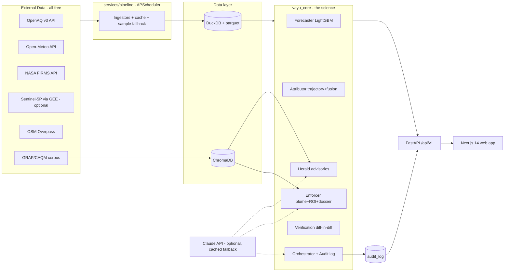

# 02 — Technical Requirements Document (TRD)
## VAYU — Verifiable Airshed Intelligence & Enforcement

| | |
|---|---|
| Version | 1.0 |
| Companion docs | `VAYU_MASTER_BUILD_PROMPT.md` (scope/build order), `01_PRD.md` (what/why), `03_App_Flow.md` (UX behavior) |
| Precedence | If this doc conflicts with the master prompt on scope, master prompt wins. On technical detail, this doc wins. |

---

## 1. System Architecture



Two deployable services (`web`, `api`) + one embedded scheduler inside `api`. No microservices — a modular monolith with `vayu_core` as a clean, tested, importable package (this is where "Technical Excellence" is judged).

## 2. Stack & Versions

| Layer | Choice | Version | Why |
|---|---|---|---|
| Web | Next.js (App Router, TS) | ≥14 | team skill, SSR-fast demo |
| UI kit | Tailwind + shadcn/ui | latest | production look, fast |
| Map | MapLibre GL JS + deck.gl | ≥3 / ≥9 | free (no token), TripsLayer animation |
| Charts | Recharts | ≥2 | bands + reference lines |
| Motion | Framer Motion | ≥11 | micro-interactions |
| API | FastAPI + uvicorn | ≥0.110 | typed, async, quick |
| Storage | DuckDB + parquet | ≥1.0 | zero-ops, fast analytics, judges can open it |
| ML | LightGBM, scikit-learn, shap | latest | tabular SOTA, explainable |
| RAG | ChromaDB embedded | ≥0.5 | no server |
| PDF | WeasyPrint (reportlab fallback) | latest | HTML→PDF dossiers |
| Sched | APScheduler | ≥3.10 | in-process cron |
| LLM | anthropic SDK | latest | optional, cached fallback mandatory |

## 3. Data Architecture

### 3.1 DuckDB schema (file: `data/vayu.duckdb`)

```sql
-- observations from OpenAQ (long format)
measurements(city TEXT, station_id TEXT, param TEXT,          -- pm25|pm10|no2
  ts TIMESTAMPTZ, value DOUBLE, unit TEXT, source TEXT,       -- live|sample
  PRIMARY KEY(city, station_id, param, ts));

stations(city TEXT, station_id TEXT PRIMARY KEY, name TEXT,
  lat DOUBLE, lon DOUBLE, provider TEXT, first_seen TIMESTAMPTZ, last_seen TIMESTAMPTZ);

weather_hourly(city TEXT, grid_i INT, grid_j INT, ts TIMESTAMPTZ,
  temp_c DOUBLE, rh DOUBLE, wind_speed_10m DOUBLE, wind_dir_10m DOUBLE,
  wind_speed_100m DOUBLE, wind_dir_100m DOUBLE, pblh DOUBLE,
  precip DOUBLE, pressure DOUBLE, kind TEXT,                  -- hist|forecast
  PRIMARY KEY(city, grid_i, grid_j, ts, kind));

fires(city TEXT, fire_id TEXT PRIMARY KEY, lat DOUBLE, lon DOUBLE,
  frp DOUBLE, confidence TEXT, acq_ts TIMESTAMPTZ, sensor TEXT, source TEXT);

wards(city TEXT, ward_id TEXT, name TEXT, geom_geojson TEXT,
  centroid_lat DOUBLE, centroid_lon DOUBLE, population INT, pop_source TEXT,
  PRIMARY KEY(city, ward_id));

forecasts(city TEXT, ward_id TEXT, run_ts TIMESTAMPTZ, target_ts TIMESTAMPTZ,
  horizon_h INT, p10 DOUBLE, p50 DOUBLE, p90 DOUBLE, aqi_p50 INT, model_ver TEXT,
  PRIMARY KEY(city, ward_id, run_ts, target_ts));

attributions(city TEXT, ward_id TEXT, computed_ts TIMESTAMPTZ, category TEXT,
  share_pct DOUBLE, confidence DOUBLE, evidence_json TEXT,
  PRIMARY KEY(city, ward_id, computed_ts, category));

interventions(id TEXT PRIMARY KEY, city TEXT, ward_id TEXT, created_ts TIMESTAMPTZ,
  action_type TEXT, title TEXT, source_lat DOUBLE, source_lon DOUBLE,
  predicted_ugm3_averted DOUBLE, population_protected INT, effort_units INT,
  confidence DOUBLE, roi_score DOUBLE,
  status TEXT,                    -- candidate|dispatched|executed|verified
  dossier_path TEXT, signal_ts TIMESTAMPTZ, dispatched_ts TIMESTAMPTZ,
  executed_ts TIMESTAMPTZ, seeded BOOLEAN DEFAULT FALSE);

verifications(intervention_id TEXT PRIMARY KEY, method TEXT,   -- did
  control_wards TEXT, predicted_reduction DOUBLE, observed_reduction DOUBLE,
  ci_low DOUBLE, ci_high DOUBLE, pct_realized DOUBLE, computed_ts TIMESTAMPTZ);

audit_log(id BIGINT PRIMARY KEY, ts TIMESTAMPTZ, agent TEXT, trigger TEXT,
  inputs_hash TEXT, decision TEXT, reasoning TEXT, confidence DOUBLE, duration_ms INT);

grap_drafts(id TEXT PRIMARY KEY, city TEXT, stage INT, trigger_forecast_ts TIMESTAMPTZ,
  measures_json TEXT, citations_json TEXT, status TEXT);      -- draft|approved|expired
```

### 3.2 City config schema (`config/cities/delhi.json`)

```json
{
  "id": "delhi", "name": "Delhi", "timezone": "Asia/Kolkata",
  "bbox": [76.84, 28.40, 77.35, 28.88],
  "wards_geojson": "data/samples/wards_delhi.geojson",
  "ward_population_csv": "data/samples/population_delhi.csv",
  "weather_grid": {"nx": 5, "ny": 5},
  "grap_applicable": true,
  "languages": ["en", "hi", "ur"],
  "map_center": [77.10, 28.64], "map_zoom": 10.3
}
```
Adding a city must require ONLY this file + ward geojson (or H3 fallback flag `"use_h3": true`).

## 4. Pipeline Specifications

| Source | Endpoint | Cadence | Fallback |
|---|---|---|---|
| OpenAQ v3 | `GET api.openaq.org/v3/locations?bbox=...` then `/v3/sensors/{id}/hours` (header `X-API-Key`) | backfill 24mo once; refresh 30 min | `data/samples/measurements_{city}.parquet` (60 days bundled) |
| Open-Meteo hist | `archive-api.open-meteo.com/v1/archive?latitude&longitude&hourly=...` | backfill once | bundled parquet |
| Open-Meteo fc | `api.open-meteo.com/v1/forecast?...&forecast_days=4` | hourly | bundled parquet (frozen demo timeline) |
| FIRMS | `firms.modaps.eosdis.nasa.gov/api/area/csv/{KEY}/VIIRS_SNPP_NRT/{w},{s},{e},{n}/{days}` | 3h | bundled CSV (7 days) |
| Overpass | `overpass-api.de/api/interpreter` (schools, hospitals, landuse=industrial) | once, cached geojson | bundled geojson |
| GEE S5P | `COPERNICUS/S5P/NRTI/L3_NO2` weekly mean → PNG + bounds | weekly | layer hidden |

Rules: exponential backoff (3 tries) → fallback + `source='sample'`; every ingestor is idempotent (`INSERT OR REPLACE`); all raw responses cached to `data/cache/` with TTL; a `data_status` endpoint reports per-source freshness for UI pills.

**DEMO_MODE=true:** scheduler disabled; "now" is pinned to `DEMO_NOW` timestamp inside the bundled data window so the timeline is deterministic and rehearsable.

## 5. Core Algorithms

### 5.1 Forecaster
- One LightGBM model per horizon (24/48/72h) trained on pooled station-hours (city feature included). Quantile objective, alpha ∈ {0.1, 0.5, 0.9}.
- Feature vector (per station, time t): pm25 lags {1,3,6,12,24,48}, rolling mean {6,24}, hour_sin/cos, dow, month, is_holiday; forecast-time weather at nearest grid point: u=−speed·sin(dir·π/180), v=−speed·cos(dir·π/180), speed, pblh, rh, temp, precip; `upwind_pm25` = latest pm25 of nearest station within ±45° of upwind bearing, 5–50 km; `upwind_fire_frp_24h` = Σ FRP of fires in upwind cone 50 km, last 24h.
- Hyperparams (fixed, don't tune long): `num_leaves=64, lr=0.05, n_estimators=600, min_child_samples=20, feature_fraction=0.9`. Early stopping on last-60-days validation.
- **Ward mapping:** IDW (power p=2, k=5 nearest stations) from station predictions → ward centroid; grid heat layer at ~1 km via same IDW.
- **AQI conversion:** CPCB sub-index breakpoints for PM2.5 (0-30→0-50, 31-60→51-100, 61-90→101-200, 91-120→201-300, 121-250→301-400, >250→401-500). Implement exactly; unit-test.
- **Backtest protocol (`make backtest`):** rolling-origin, last 30 days held out entirely; predictions at 00/06/12/18 UTC daily; metrics per horizon: RMSE, MAE, AQI-bucket accuracy, and crossing-detection P/R for threshold 300 (event = ward crosses within horizon). Baselines: persistence (value at t), climatology (month×hour mean). Output: `docs/evaluation.md` (tables + PNG charts) and `/meta/evaluation` JSON.

### 5.2 Back-trajectory
Backward Euler integration of the interpolated wind field: position stepped by −u·Δt, −v·Δt (Δt = 10 min, 100m winds preferred, bilinear interpolation in space, linear in time), for 6/12/24h. Dispersion cone: half-angle 15° at origin growing 0.4°/km (cap 45°). Output: `{polyline: [[lon,lat,ts],...], cone: Polygon}`. Test: uniform wind → straight line, length = speed×duration ±2%.

### 5.3 Evidence fusion & attribution
For ward w with cone C over lookback window T=24h, compute raw scores:
- `S_burn = Σ_fires∈C frp_i · exp(−d_i/20km) · recency_i` (recency = exp(−age/12h))
- `S_industry = Σ_area(industrial polygons ∩ C) · S5P_NO2_anomaly (1.0 if S5P absent)`
- `S_construction = Σ_permits∈C (2 if dust_flag_noncompliant else 1) · exp(−d_i/10km)`
- `S_traffic = road_density(w) · rush_hour_factor(t) · NO2/PM ratio uplift if NO2 elevated`
- `S_regional = (len(polyline outside city bbox) / len(polyline)) · pm25_regional_proxy`
Shares = normalized scores. Confidence per category = `f(evidence_count, wind_field_stability, station_agreement)` mapped to [0,1] via documented logistic. **The formula, weights, and their rationale must appear verbatim on the Methodology page.**
Cross-validation artifact: compare Delhi winter shares vs published IITM DSS sector ranges; report agreement/divergence honestly in evaluation.md.

### 5.4 Gaussian plume (counterfactual)
Standard formula `C(x,y,z) = Q/(2π·u·σy·σz) · exp(−y²/2σy²) · [exp(−(z−H)²/2σz²)+exp(−(z+H)²/2σz²)]` with Pasquill–Gifford σy(x), σz(x) (Briggs rural coefficients; table in code comments). Stability class from wind speed + day/night (simplified Turner). Q estimated: fires → FRP-based (Q = FRP × emission factor, cite Wooster 2005); construction/industry → category defaults (documented). Counterfactual: ward concentration delta = plume contribution at ward centroid; propagate through the next 48h wind forecast at 3h steps.

### 5.5 Intervention ROI
`ROI = (Δµg/m³ averted at t+24h) × (population_exposed in affected wards) / effort_units`. Effort lookup: burning cluster halt=1 team, construction stop-work=1, traffic corridor restriction=3, industrial curb=4. Rank descending; ties → lower effort first. Each candidate carries confidence = attribution confidence × plume model confidence (0.8 fixed factor, documented).

### 5.6 Verification (difference-in-differences)
Controls: 3 wards minimizing pre-period (7d) AQI distance, outside plume, similar population density. `observed_reduction = (target_post − target_pre) − mean(control_post − control_pre)` over 48h post-execution. CI via block bootstrap on hourly residuals (n=500). Report `pct_realized = observed/predicted` clamped [0, 150]%.

### 5.7 GRAP Autopilot
City AQI forecast (population-weighted ward p50) checked against stages I≥201, II≥301, III≥401, IV≥450. On predicted crossing within 48h → retrieve stage measures from corpus (RAG top-k with citations; fallback structured JSON) → create `grap_draft` (status=draft). Approval is always human (POST /grap/{id}/approve).

## 6. API Contract (selected examples; all endpoints in master prompt §7)

`GET /api/v1/cities/delhi/forecast?h=48`
```json
{ "run_ts": "2026-07-16T06:00:00Z", "horizon_h": 48, "model_ver": "lgbm-1.0",
  "wards": [{"ward_id":"W047","name":"Anand Vihar","p10":142,"p50":188,"p90":246,
             "aqi_p50":312,"crossing_300_eta_h":36,"confidence":0.84}],
  "grid": {"type":"FeatureCollection","features":[...]},
  "data_status": {"openaq":"live","meteo":"live","firms":"cached"} }
```

`GET /api/v1/cities/delhi/attribution/W047`
```json
{ "computed_ts":"...", "window_h":24,
  "categories":[
    {"category":"open_burning","share_pct":42,"confidence":0.87,
     "evidence":[{"type":"fire","lat":28.91,"lon":77.05,"frp":18.4,
       "acq_ts":"...","distance_km":18.2,"sensor":"VIIRS"}]},
    {"category":"traffic","share_pct":31,"confidence":0.74,"evidence":[...]}],
  "trajectory_ref":"/cities/delhi/trajectory/W047?hours=12" }
```

Errors: RFC7807 (`{"type","title","status","detail"}`). All schemas as pydantic models shared via OpenAPI; frontend generates types from `openapi.json` (openapi-typescript).

## 7. Agents & Orchestration

Event cascade (in-process, sequential, simple):
```
pipeline_refresh → forecaster.run(city) → [threshold_events]
  → attributor.run(ward) → enforcer.build_candidates(ward)
  → herald.draft_advisories(city) → audit each step
```
Each agent = class with `run()` returning `AgentResult{decision, reasoning, confidence, artifacts}`; orchestrator persists to `audit_log` and emits SSE. Reasoning text: LLM-summarized when key present (prompt: "Summarize this decision for an audit log in 2 sentences, factual"), else deterministic template. **Stopwatch:** `signal_ts` = threshold event time; `dispatched_ts` set on dossier generation; expose delta.

## 8. LLM Integration (all optional, all cached)

| Use | Prompt sketch | Fallback |
|---|---|---|
| Advisories | system: public-health comms officer; input: ward, AQI, forecast, audience, language; output ≤80 words, actionable | pre-written templates × severity × audience × language |
| GRAP RAG | retrieve top-5 chunks → answer with clause citations `[GRAP Stage III, cl. 4]` | structured clauses JSON lookup |
| Audit summaries | 2-sentence factual summary | template |
Cache key = SHA256(prompt) → `data/samples/llm_cache.json`. Pre-warm the cache for the entire golden flow during Phase 5 so demo works offline.

## 9. Frontend Architecture

- Routes per master prompt §8. State: TanStack Query (server cache) + Zustand (map/UI state: city, layers, time-scrubber position, selected ward).
- Map: one `<MapCanvas>` with declarative layer registry: `heatGrid (deck.gl HeatmapLayer)`, `wardChoropleth (GeoJsonLayer)`, `stations (IconLayer)`, `fires (IconLayer, size~frp)`, `trajectory (TripsLayer, animated via requestAnimationFrame loop)`, `plumeCone (PolygonLayer, 30% opacity)`. Layer toggles persist in Zustand.
- Time scrubber drives `forecast grid` frame index (pre-fetched frames at 3h steps, −24h…+72h).
- SSE hook for audit stream with reconnect.
- i18n: dictionary JSON per language for citizen surface; commissioner surface EN only.
- Component conventions: shadcn/ui primitives; every data component has `<Skeleton>`, `<EmptyState>`, `<ErrorState reload>` variants.

## 10. Error Handling, Logging, Performance

- API: structured logging (loguru) with request IDs; pipeline failures escalate to `data_status`, never crash the app.
- Web: error boundaries per route; toast on mutation failure with retry.
- Budgets: initial JS < 450KB gz (dynamic-import deck.gl); forecast endpoint < 300ms warm (precompute per run, don't compute per request — API reads from `forecasts` table); dossier PDF < 4s.

## 11. Testing Strategy

pytest for `vayu_core` (trajectory, plume, AQI conversion, ROI, DiD math, backtest metrics on synthetic truth) — target ≥80% coverage of core; FastAPI TestClient smoke tests for every endpoint in DEMO_MODE; one Playwright script that walks golden flow steps 1–7 (used as pre-demo check: `make demo-check`).

## 12. Build, Run, Deploy

```
make dev        # concurrently: uvicorn --reload + next dev
make seed       # download-or-copy samples → duckdb load → train if missing → backtest
make backtest   # regenerate docs/evaluation.md + /meta/evaluation
make demo-check # playwright golden-flow walk
docker-compose up   # web:3000, api:8000, volumes for data/
```
Optional live deploy: web → Vercel, api → Railway/Render (Dockerfile provided). `DEMO_NOW` env pins demo timeline.

## 13. Security & Privacy

No PII collected or stored. Public data only. API keys server-side only (never NEXT_PUBLIC). Dossiers watermarked "PROTOTYPE — ET AI Hackathon 2026, not an official document." Rate-limit dossier generation (5/min) to keep WeasyPrint stable.
