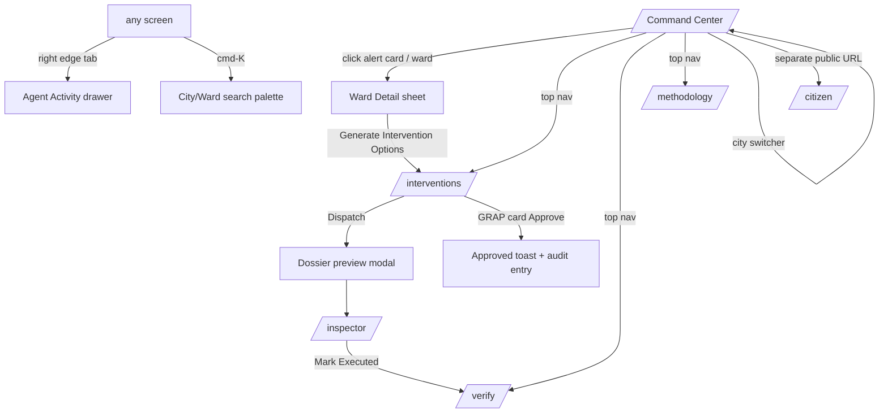

# 03 — App Flow Document
## VAYU — Verifiable Airshed Intelligence & Enforcement

| | |
|---|---|
| Version | 1.0 |
| Companion docs | `VAYU_MASTER_BUILD_PROMPT.md`, `01_PRD.md`, `02_TRD.md` |
| Purpose | Exact navigation, screen states, interactions, and lifecycles. If a screen behavior is ambiguous elsewhere, this doc decides. |

---

## 1. Navigation Map



Top nav (commissioner surfaces): `VAYU ◆ [City switcher] | Command | Interventions | Verify | Methodology` + data-freshness pills + Agent drawer toggle. Citizen and Inspector are chrome-less standalone routes (linked from README and demo bookmarks, not from commissioner nav).

---

## 2. Persona Journeys (end-to-end)

### J1 — Commissioner: "Bad air is coming; stop it at the source" (THE golden flow)
1. Opens `/` → Delhi Command Center. KPI rail counts up; map renders ward choropleth.
2. Notices amber **alert card**: "Ward W047 Anand Vihar — AQI 312 predicted in 36h · confidence 0.84". Clicks.
3. Map flies to ward; **Ward Detail sheet** slides in: forecast chart with band crossing the red 300 line; "Why this forecast?" shows `Upwind fires +22` among top factors.
4. Scrolls to **Attribution donut**: open_burning 42% (ring 0.87). Clicks the slice.
5. Sheet collapses to half-height; map animates the **back-trajectory** flowing 18 km NW to a cluster of flame icons; evidence list shows 6 VIIRS detections with timestamps/distances.
6. Clicks **"Generate Intervention Options"** → `/interventions` with ward filter applied.
7. **ROI leaderboard** row 1: "Halt open burning cluster — Bawana sector · −61 µg/m³ peak · 38,000 people · 1 team · conf 0.73". Expands row → counterfactual chart (with/without action).
8. Clicks **Dispatch** → dossier PDF renders in preview modal (map snapshot, evidence table, "GRAP Stage II, clause 6 — citation", predicted impact, order ID) → "Send to Inspector".
9. Toast: "Order VAYU-DL-0047 dispatched · signal→dossier 3m 42s". Agent drawer shows the full reasoning chain.
10. On the ward sheet, clicks "Notify 14 schools in plume path" → WhatsApp-style panel shows Hindi message bubbles → Confirm.
11. Later: `/verify` → sees seeded verified intervention: "Predicted −58 · Observed −54 (93% realized)".
12. City switcher → **Lucknow** → same surfaces, different data, < 2s.

### J2 — Inspector: "Get the order, do the job"
1. Opens `/inspector` on a phone (or narrow window). Order list, newest first, status chips.
2. Taps order VAYU-DL-0047 → map pin + directions link, evidence checklist (satellite detections, photos placeholder), dossier download button, regulation citation highlighted.
3. Taps **Mark Executed** → note field ("burning extinguished 14:20, 3 violations issued") → Submit.
4. Status chip → Executed; verification countdown starts ("results in ~48h").

### J3 — Citizen: "Can my kid play outside today?"
1. Opens `/citizen` → ward selector (or geolocate). Picks ward.
2. Sees huge AQI numeral + face icon + category label; 48h sparkline; **Clean Hours strip**: green blocks 06–09.
3. Switches language to हिंदी → all content re-renders.
4. Reads "Children & Schools" advisory card: specific, ≤80 words, actionable.
5. Taps share → advisory card rendered as an image-style card (bonus if time allows; else copy-link).

---

## 3. Screen-by-Screen States & Interactions

For EVERY async region implement 4 states: `loading (skeleton)`, `ready`, `empty (designed illustration + hint)`, `error (message + retry button)`. Never a blank div, never a spinner-only page.

### 3.1 Command Center `/`
| Element | States & behavior |
|---|---|
| Map | skeleton shimmer → choropleth fade-in 250ms. Hover ward = tooltip (name, AQI, trend). Click = Ward Detail. Layer chips toggle with 150ms fade. |
| KPI rail | count-up animation once per load. GRAP badge pulses amber/red when stage ≥ II forecast. |
| Alert cards | sorted by ETA asc; max 4 visible + "N more"; enter animation slide-from-right; dismiss = X (returns via reload). Empty: "No hazard crossings predicted — air holding steady ✓". |
| Time scrubber | −24h…+72h, 3h steps; drag animates heat grid frames; play button auto-advances 600ms/frame; "now" tick highlighted; frames pre-fetched (no fetch during drag). |
| Data pills | per-source `live` (green dot) / `cached` (gray) / `sample` (amber); tooltip shows last refresh ts. |
| Agent drawer | right-edge tab; opens 380px; SSE stream; new entries slide-in; each entry: agent tag color, decision, reasoning (expandable), confidence bar, duration. |

### 3.2 Ward Detail (sheet over map, route `/ward/[id]` for deep-link)
- Header: name, live AQI dial (animated arc), category chip, freshness pill.
- Forecast chart: observed 48h (solid) + forecast 72h (dashed, p10–p90 band); reference lines 200/300/400; crossing point annotated with flag + ETA.
- "Why this forecast?": 6 horizontal bars (SHAP), signed colors, plain-English labels; info icon → Methodology.
- Attribution donut: slices with confidence rings; center shows dominant source; clicking slice → map highlights its evidence + evidence list scrolls into view; each evidence item hover-syncs with map marker (pulse).
- Trajectory controls: 6h/12h/24h toggle; Play re-runs the TripsLayer animation.
- Footer CTA: "Generate Intervention Options" (primary, disabled with tooltip if attribution confidence < 0.3).
- Error case: no attribution computable (calm wind field) → show "Attribution unavailable: stagnant conditions — local sources dominant" (honest, not blank).

### 3.3 Interventions `/interventions`
- Filter bar: city (from switcher), ward chip (deep-linked), action type.
- Leaderboard table: rank medal for #1; ROI score bar; sortable columns; row expand = counterfactual chart + evidence mini-list + effort breakdown.
- Dispatch flow: click → modal with embedded dossier PDF preview (iframe) → confirm "Send to Inspector" → optimistic status chip `candidate→dispatched`, toast with stopwatch time, audit entry visible if drawer open.
- GRAP Autopilot card (conditional): stage badge, trigger forecast sparkline, drafted measures list with citation chips, "human-in-the-loop" badge, Approve (primary) / Dismiss. Approve → confirmation dialog → toast + audit entry.
- Empty state: "No candidates — no wards currently flagged. Lower the threshold in demo settings or run the seeder."

### 3.4 Inspector `/inspector` (mobile-first, max-w-md centered on desktop)
- List: order cards (id, ward, action, status chip, age). Pull-to-refresh gesture optional; refresh button required.
- Order page: static map, evidence checklist with checkboxes (local state), dossier download, regulation callout box, Mark Executed → note textarea → submit → success screen with verification countdown.
- Status colors: dispatched=blue, executed=violet, verified=green.

### 3.5 Citizen `/citizen`
- Onboarding row: ward select (searchable) + "Use my location" (browser geolocation → nearest ward centroid; graceful denial fallback to selector).
- AQI hero: numeral (count-up), face icon per bucket, category text in selected language.
- Clean Hours strip: 48 hour-blocks colored by forecast bucket; green blocks labeled "Best: 06–09 AM".
- Advisory cards: 4 audience tabs; content ≤80 words; source line "VAYU forecast · updated 06:00".
- Language switcher: EN | हिंदी | (+1); persists in localStorage-free memory (React state) — note: no localStorage in artifacts contexts; in the real Next.js app a cookie is fine.
- School alert preview (if arrived via commissioner "notify" deep-link): banner showing the alert as citizens would receive it.

### 3.6 Verify `/verify`
- Cards per executed/verified intervention: predicted vs observed horizontal bars, DiD chart (target vs synthetic control), % realized ring, CI text, stopwatch stat, "Seeded demo record" badge where applicable.
- Pending state: countdown "verification completes in 31h" + explanation of method (link to Methodology).

### 3.7 Methodology `/methodology`
Static-ish page, judge-oriented: data sources table w/ live status; backtest tables + charts from `/meta/evaluation`; attribution formula (rendered math); plume + DiD method summaries; corpus list; limitations (honest bullets: IDW smoothing, plume simplifications, sample permits, S5P optionality); "Cost to run" comparison vs supercomputer DSS.

---

## 4. Lifecycles (state machines)

### 4.1 Intervention
```
candidate --Dispatch--> dispatched --Mark Executed--> executed --48h data--> verified
   |                        |                             |
   +--supersede (new run)---+--expire 72h no action-------+   (terminal: verified | expired)
```
Guards: Dispatch requires dossier generated OK; Executed requires inspector note; Verified requires ≥40h post-execution data (else stays `executed` with countdown).

### 4.2 Alert (threshold event)
`raised → acknowledged (clicked) → resolved (forecast dropped below threshold) | escalated (crossed observed)`. Resolved alerts leave a gray history entry in the drawer.

### 4.3 GRAP draft
`draft → approved | dismissed | expired (forecast no longer crossing)`. Approved drafts render a persistent banner on Command Center: "GRAP Stage II measures active · approved 14:02".

### 4.4 Data freshness
`live → stale (>2× cadence) → cached (fallback engaged)`. Pill colors green→amber→gray; tooltip explains.

---

## 5. System Event Flow (agent cascade timing)

```
T+0s    pipeline refresh completes (or DEMO_NOW tick)
T+2s    Forecaster runs city → forecasts table updated → SSE: "Forecaster: 272 wards scored"
T+4s    Threshold scan → alert W047 → SSE + alert card appears
T+6s    Attributor(W047) → trajectory + fusion → SSE: "Attributor: open_burning 42% (0.87)"
T+9s    Enforcer builds 5 candidates → leaderboard ready → SSE
T+10s   Herald drafts advisories (cache-warm) → citizen content updated → SSE
        [stopwatch keeps running until commissioner dispatches → dispatched_ts]
```
In DEMO_MODE this cascade is triggered by a hidden "Run cycle" button (`?demo=1` query param reveals it) so the presenter can fire it live during the video.

---

## 6. Golden Demo Flow — timed shot list (3:45 target)

| t | Action (presenter) | Screen must show |
|---|---|---|
| 0:00 | Open `/` Delhi | KPIs count up, choropleth, pills `live/cached` |
| 0:20 | Press hidden Run-cycle; open Agent drawer | SSE entries streaming, agent tags |
| 0:40 | Click alert W047 | flyTo + Ward sheet, band crossing 300, SHAP bars |
| 1:10 | Click burning slice | trajectory animation → fire cluster + evidence list |
| 1:45 | Generate options → leaderboard | #1 row, −61 µg/m³, 38k people |
| 2:10 | Expand row → Dispatch | counterfactual chart → dossier PDF preview → send |
| 2:35 | Switch to `/inspector` (phone frame) | order received, citation visible |
| 2:50 | Back → notify schools → citizen page in Hindi | WhatsApp bubbles → citizen hero + clean hours |
| 3:10 | `/verify` | seeded verified card, 93% realized, stopwatch 3m42s |
| 3:30 | City switch → Lucknow | full re-render < 2s, "one config file" line |

Every step above is a hard acceptance test: `make demo-check` (Playwright) walks steps at machine speed nightly.

---

## 7. Edge Cases & Fallback Behaviors

| Situation | Behavior |
|---|---|
| No API keys at all | DEMO_MODE banner (subtle, footer): "Running on bundled sample data — add keys for live feeds"; all flows work |
| OpenAQ live but FIRMS down | fires layer pill `cached`; attribution uses cached fires with timestamp disclosure |
| Calm/variable wind (trajectory unstable) | Attribution confidence ↓; UI states stagnant-conditions message; Enforcer suppresses long-range candidates |
| No fires in cone but burning share high from history | show "historical pattern" evidence type, clearly labeled |
| Ward with no nearby station (>25 km) | forecast shown with `low-confidence` watermark + wider band; documented in limitations |
| Dossier PDF generation failure | fallback to HTML print view; toast explains; never blocks Dispatch |
| LLM key rate-limited mid-demo | cache serves; if novel request, template fallback within 200ms |
| Browser without WebGL | map falls back to static ward SVG list view with same data (rare; low effort: render table + mini svg map) |
| Lucknow ward geojson missing | H3 hex zones auto-generated, labeled "analysis zones" |

---

## 8. Copy Tone Guide (microcopy matters for UX score)

- Commissioner surfaces: terse, operational. "Dispatch", "Signal → dossier: 3m 42s", "38,000 people in plume path". No exclamation marks.
- Citizen surfaces: warm, plain, actionable. "Air is poor this afternoon. Best time outside: 6–9 AM."
- Honesty microcopy everywhere data is imperfect: "cached", "sample", "low confidence", "seeded demo record".
- Numbers always with units; timestamps always localized (IST).
