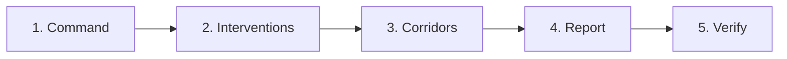
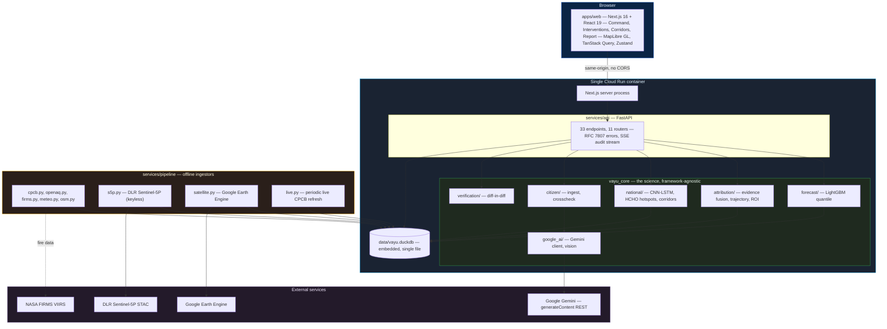
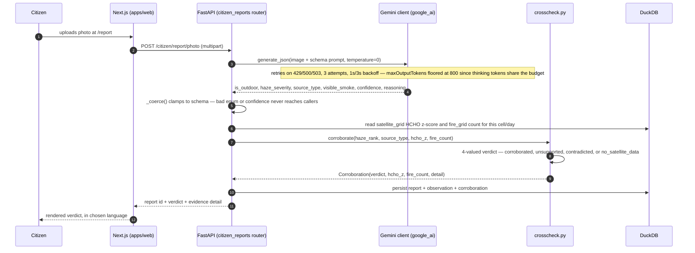
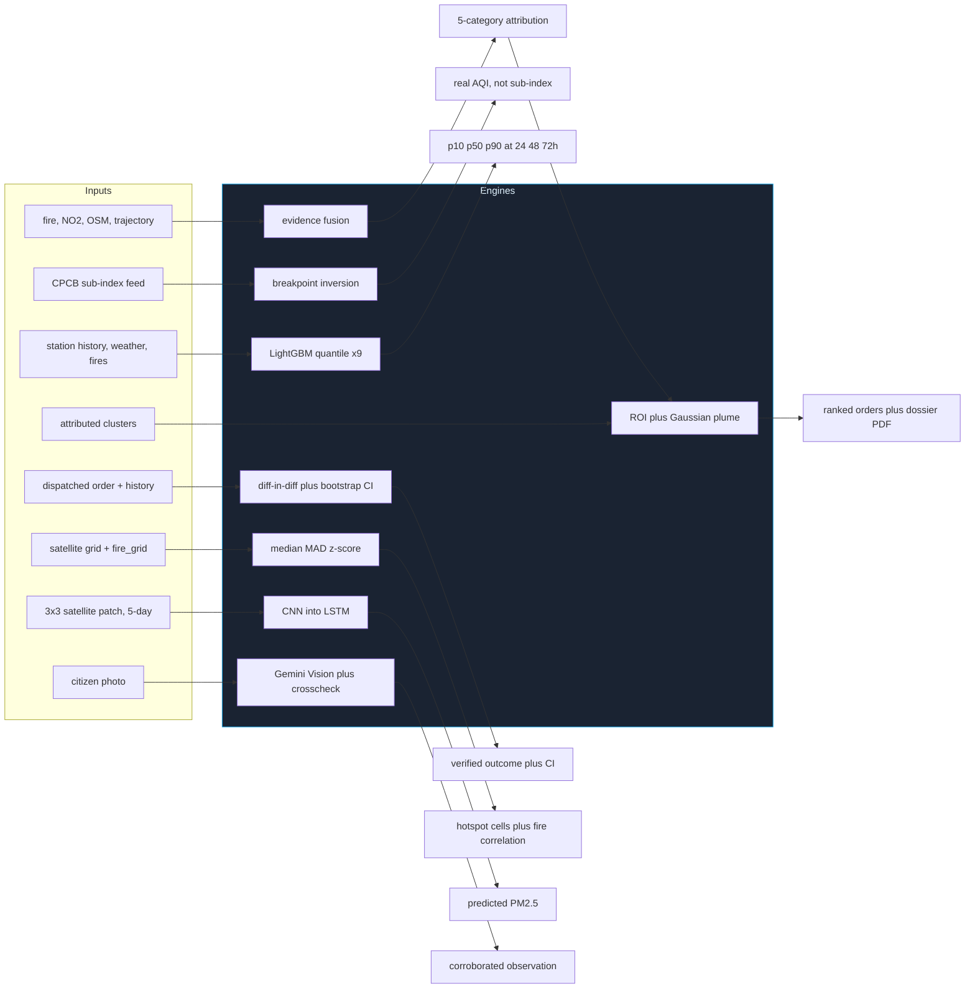
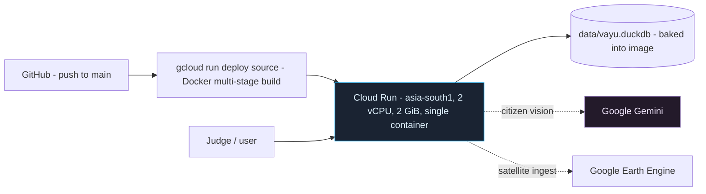

<div align="center">

# VAYU — Verifiable Airshed Intelligence & Enforcement

**Dashboards measure pollution. VAYU prosecutes it — and sees the whole country doing it.**

*वायु — "wind, air, the breath of life."*

[](https://vayu-802568501157.asia-south1.run.app)
[](#testing)
[](#8--citizen-photograph--gemini-vision--corroboration)
[](#the-national-satellite-layer)
[](requirements.txt)
[](apps/web/package.json)

**[Live Application](https://vayu-802568501157.asia-south1.run.app)** ·
**[API Docs](https://vayu-802568501157.asia-south1.run.app/docs)** ·
**[Methodology](https://vayu-802568501157.asia-south1.run.app/methodology)** ·
**[Corridors](https://vayu-802568501157.asia-south1.run.app/corridors)**

*Build with AI: Code for Communities · Track 2 — Clean Air & Climate Resilience*

`air-quality` · `environmental-monitoring` · `machine-learning` · `computer-vision` · `satellite-imagery`
`google-gemini` · `google-earth-engine` · `sentinel-5p` · `lightgbm` · `pytorch` · `cnn-lstm` · `duckdb`
`fastapi` · `nextjs` · `maplibre` · `google-cloud-run` · `causal-inference` · `difference-in-differences`
`gaussian-plume` · `india` · `gov-data` · `enforcement` · `hackathon`

</div>

---

<div align="center">

| | | | | | |
|:--:|:--:|:--:|:--:|:--:|:--:|
| **15,360** | **6** | **5** | **74,386** | **0.838** | **324** |
| national grid cells | satellite pollutant channels | economic corridors | real fire detections | CNN-LSTM Pearson r | tests passing |

*Every figure above is read from the actual running system — the deploy database, the test suite, and `docs/surface_aqi_evaluation.json` — not asserted.*

</div>

---

## Table of contents

- [The problem](#the-problem)
- [What VAYU does](#what-vayu-does)
- [A five-minute tour](#a-five-minute-tour)
- [Screens](#screens)
- [System architecture](#system-architecture)
- [Request lifecycle](#request-lifecycle)
- [How VAYU actually works](#how-vayu-actually-works)
  - [1 · CPCB AQI conversion](#1--cpcb-aqi-conversion--and-the-sub-index-inversion-bug-it-fixes)
  - [2 · Short-term forecast](#2--short-term-forecast--lightgbm-quantile-regression)
  - [3 · Source attribution](#3--source-attribution--multi-evidence-fusion)
  - [4 · Ranked interventions](#4--ranked-interventions--roi--gaussian-plume-counterfactual)
  - [5 · Outcome verification](#5--outcome-verification--difference-in-differences)
  - [6 · National satellite grid & HCHO hotspots](#6--national-satellite-grid--hcho-hotspot-detection)
  - [7 · Surface AQI from orbit](#7--surface-aqi-from-orbit--cnn-lstm)
  - [8 · Citizen photo → Gemini](#8--citizen-photograph--gemini-vision--corroboration)
- [The data pipeline](#the-data-pipeline)
- [Model registry](#model-registry)
- [Training and evaluation](#training-and-evaluation)
- [Two bugs found by testing, not by reading](#two-bugs-found-by-testing-not-by-reading)
- [The dataset](#the-dataset)
- [Data sources & API keys](#data-sources--api-keys)
- [Deployment](#deployment)
- [How VAYU differs](#how-vayu-differs)
- [Tech stack](#tech-stack)
- [Getting started](#getting-started)
- [Environment variables](#environment-variables)
- [Project structure](#project-structure)
- [Testing](#testing)
- [API reference](#api-reference)
- [Known limitations](#known-limitations)
- [Roadmap](#roadmap)
- [Hackathon requirement coverage](#hackathon-requirement-coverage)
- [License](#license)

---

## The problem

India runs 900+ CAAQMS air-quality monitoring stations, yet a 2024 CAG audit
found **69% of monitored cities have no actionable response protocol**
connected to those readings.

| Today | Consequence |
|---|---|
| CPCB SAMEER measures, but does not act | A reading with no owner and no deadline |
| SAFAR forecasts, but only 4 cities | Everywhere else flies blind on tomorrow |
| IITM's Delhi DSS attributes sources — Delhi-only, winter-only, supercomputer-bound | Not something a smaller city, or a different season, can run |
| No system federates across state lines | Pollution crosses seven states on the Amritsar–Kolkata corridor; no bulletin does |
| No system verifies a citizen's own evidence | A photo report is either ignored or trusted blindly — never checked |

VAYU closes every one of those gaps in the same codebase, at two scales at once.

## What VAYU does

<table>
<tr><td width="33%" valign="top">

### 🏙️ City enforcement loop

**Closed-loop engine**
`READING → RESPONSIBLE SOURCE → RANKED INTERVENTION → ENFORCEMENT ORDER → VERIFIED OUTCOME`,
for Delhi, Delhi-NCR and Lucknow, on a laptop, zero mandatory keys.

**Dispatch-ready dossiers**
A ranked intervention becomes a PDF with a map, an evidence table, a
regulation citation, a predicted impact and a sign-off block — not a chart.

**Outcome verification**
Difference-in-differences against real CPCB history, with a confidence
interval and an honest null-result verdict when the data says so.

</td><td width="33%" valign="top">

### 🛰️ National satellite intelligence

**15,360-cell grid over India**
Six pollutant channels (HCHO, NO₂, SO₂, CO, O₃, AOD) from two independent
satellite sources, unified into one schema.

**HCHO hotspot detection**
Robust per-cell anomaly scoring (median/MAD, not mean/std) against a 60-day
baseline, cross-checked against real VIIRS fire counts.

**Surface AQI from orbit alone**
A CNN-LSTM predicts ground-level PM2.5 from satellite inputs — evaluated
honestly, including where it does *not* beat its own baseline.

</td><td width="33%" valign="top">

### 🤝 Citizen + Google AI

**Gemini Vision**
Reads a citizen's pollution photo into a structured observation — haze
severity, likely source, confidence — never a guessed numeric AQI.

**Independent-evidence corroboration**
A citizen's claim is trusted only when real satellite/fire data in the same
cell/day backs it up — never by reporter reputation.

**Federated corridor bulletins**
Five economic corridors, each a versioned (`vayu.corridor.v1`),
self-describing daily bulletin any state can consume over plain HTTP.

</td></tr>
</table>

---

## A five-minute tour

The fastest way to understand VAYU is to click through it in this order, on
the [live application](https://vayu-802568501157.asia-south1.run.app):



| Stop | What to look at | Why it matters |
|---|---|---|
| **1 · Command** | The ward choropleth and hazard-alert rail | 290 real wards, colour-coded by real CPCB-derived AQI, not a placeholder map |
| **2 · Interventions** | Expand a candidate's rationale | Every ROI number cites *which* evidence it came from — click through to the source |
| **3 · Corridors** | Switch to the IGP spine, change the date | Coverage is shown next to every number — a cell the satellite couldn't see is never mistaken for a clean one |
| **4 · Report** | Submit a photo, or read `/api/v1/citizen/reports` | The corroboration verdict names the real HCHO z-score or fire count behind it |
| **5 · Verify** | Read a dispatched order's diff-in-diff result | Includes a real order that came back statistically insignificant — shown, not hidden |

> **The one thing to click:** an evidence link on the Interventions page. Everything
> else is a number — that link is the proof behind it.

---

## Screens

| Screen | Route | What it shows |
|---|---|---|
| **Command Center** | `/` | Ward choropleth, stations, hazard alerts, trajectory/dispersion cone, KPIs, Delhi ↔ Lucknow in < 2 s |
| **Interventions** | `/interventions` | ROI-ranked leaderboard, expandable counterfactuals, one-click dispatch → dossier PDF, GRAP Autopilot card |
| **Inspector** | `/inspector` | Mobile order list, evidence checklist, dossier download, mark-executed |
| **Verify** | `/verify` | Difference-in-differences: predicted vs. observed, with a confidence interval |
| **Corridors** | `/corridors` | Five national economic corridors, each with a versioned daily bulletin |
| **Citizen report** | `/report` | Submit a pollution photo or sensor reading; Gemini + satellite/fire cross-check it |
| **Public Citizen view** | `/citizen` | Public AQI + clean-hours + health advisories in **English, हिंदी, ਪੰਜਾਬੀ** |
| **Methodology** | `/methodology` | Backtest tables, formulas, and a limitations section written for a skeptical judge |
| **Agent Activity drawer** | everywhere | Streams every automated decision with its reasoning and confidence (SSE) |

---

## System architecture



A city is one config file. `config/cities/{delhi,delhi_ncr,lucknow}.json` and
`config/regions/india.json` / `config/corridors/india.json` are the only
place-specific artifacts; no code branches on a city or corridor id.

### Three decisions worth explaining

**One container, not two services.** FastAPI and the built Next.js app run in
the same image — Next proxies `/api/v1` to a local FastAPI process on
`127.0.0.1:8000`. One URL for a judge to open, no CORS, no cross-service
latency, and one `gcloud run deploy` instead of coordinating two.

**DuckDB, not a managed database.** A single embedded file is columnar-fast
enough to score 290 wards live and small enough to bake directly into the
container image. There is nothing to provision, nothing to point a connection
string at, and no separate billing surface for a hackathon-scale workload.

**PyTorch stays out of the request path.** The CNN-LSTM (`vayu_core/national/surface_aqi.py`)
trains and scores **offline**, writing its predictions to `aqi_grid`. The live
API never imports `torch` per request, so the deployed container's memory
floor doesn't have to assume a ~800 MB dependency it only needs at training
time.

---

## Request lifecycle

What actually happens between a citizen submitting a pollution photo and the
report appearing, corroborated, on `/api/v1/citizen/reports`:



Two things are deliberate here. First, `GeminiUnavailable` is raised, never
swallowed into a guessed reading — `POST /citizen/report/photo` returns an
honest "unavailable" when no `GOOGLE_API_KEY` is set, rather than fabricating
an observation. Second, the corroboration verdict is **four-valued, not
binary** (`vayu_core/citizen/crosscheck.py`): a satellite swath gap over the
cell is recorded as `no_satellite_data`, never silently folded into
"unsupported" or, worse, "contradicted" — a cloud gap is a statement about the
satellite, not about the citizen.

---

## How VAYU actually works

Eight computations carry the whole system, each documented here from real
input to real output — code path, the actual algorithm, and the honest
caveats, not the marketing version.



### 1 · CPCB AQI conversion — and the sub-index inversion bug it fixes

**Code** [`vayu_core/aqi.py`](vayu_core/aqi.py) · pure function, no model

CPCB's official scheme (`sub_index()`, line 105) is piecewise-linear per
pollutant: `I = I_lo + (I_hi − I_lo) × (C − C_lo) / (C_hi − C_lo)`, and the
station AQI is the **maximum** across available sub-indices — CPCB's
worst-pollutant-wins rule (`aqi_from_concentrations()`, line 193).

**The bug this file exists to fix.** India's real-time feed (CPCB CAAQMS via
data.gov.in) publishes **sub-indices**, not concentrations, despite field
names like `avg_value` implying otherwise. Read naively, every Delhi station
reads *"AQI 500 Severe"* in monsoon. The giveaway is CO: a published value of
~52 is impossible as mg/m³ (severe poisoning) and impossible as µg/m³ (below
ambient) — but exact as a *sub-index* of 52. `concentration_from_sub_index()`
(line 129) inverts the same monotonic breakpoint table CPCB used to build the
index, recovering a real concentration to within CPCB's own integer-rounding
error (about ±1–3 µg/m³ across the PM2.5 range).

Two honesty properties worth noting: `sub_index()` returns `None`, not `0`,
when a pollutant is missing — an AQI of 0 is a claim about clean air, `None`
is an absence, and the UI renders them differently. And the inverted value is
explicitly a **24-hour average** for PM2.5/PM10/NO2/SO2 (8-hour for CO/O3) per
CPCB's own definition — callers that need hourly resolution must not treat it
as instantaneous.

---

### 2 · Short-term forecast — LightGBM quantile regression

**Endpoint** `GET /cities/{id}/forecast?h=24|48|72` · **Code** [`vayu_core/forecast/model.py`](vayu_core/forecast/model.py), [`features.py`](vayu_core/forecast/features.py)

**Nine independent models**, not one. `QUANTILES = {p10: 0.1, p50: 0.5, p90: 0.9}`
× `HORIZONS = (24, 48, 72)` — each an `LGBMRegressor` with fixed hyperparameters
(`num_leaves=64, learning_rate=0.05, n_estimators=600` — "don't tune long,"
per the code's own TRD reference), trained on all three cities pooled via a
`city_code` feature.

**The model predicts a residual, not a level.** The docstring cites a
measured failure of the level-target version: it lost to plain persistence by
**53% on RMSE**, because holdout stubble-season means (205 µg/m³) run 3.6×
hotter than training means (57 µg/m³) — trees cannot extrapolate past leaves
they saw in training. Predicting `y − pm25(t)` and adding it back to a live
anchor sidesteps that ceiling entirely.

**Feature families** (`FEATURE_COLUMNS`, `features.py:113`):

| Family | Examples |
|---|---|
| Lags | `pm25_lag{1,3,6,12,24,48}`, `pm10_lag1`, `no2_lag1` |
| Rolling | `pm25_roll6`, `pm25_roll24`, `pm25_delta_24h` |
| Calendar | `hour_sin/cos`, `dow`, `month`, `is_holiday` (India + state subdivisions) |
| Weather (now + forecast) | `wind_speed`, `wind_dir_sin/cos`, `pblh`, `rh`, `precip`, `vent_index` at issue time **and** at `t+horizon` — real Open-Meteo forecast values, not leakage |
| Upwind | nearest station in a ±45° cone, 5–50 km |
| Fire | `upwind_fire_frp_24h` (local, 50 km/24h) and `_regional_48h` (50–300 km/48h, ±30° cone) |

**Quantile-crossing fix.** Because p10/p50/p90 are fit independently, nothing
guarantees p10 ≤ p50 ≤ p90 on a given row. `Forecaster.predict` (line 222)
`np.sort`s each row's three predictions before returning them, then clips at
zero.

**Explainability that is real, not a proxy.** `Forecaster.explain` (line 246)
uses LightGBM's exact tree SHAP (`pred_contrib=True`) on the p50 model — a
genuine per-prediction decomposition, not a global feature-importance chart
standing in for one.

**Backtest** (`forecast/backtest.py`) holds out the **last 30 days entirely**,
retrains on strictly-earlier data, and issues forecasts at 00/06/12/18 UTC
each holdout day against two honest baselines: persistence (value at issue
time) and climatology (month × hour-of-day mean from the training period
only). Results in [Training and evaluation](#training-and-evaluation).

---

### 3 · Source attribution — multi-evidence fusion

**Endpoint** `GET /cities/{id}/attribution/{ward_id}` · **Code** [`vayu_core/attribution/fusion.py`](vayu_core/attribution/fusion.py)

Five source categories are scored independently and normalised into a share:
`open_burning`, `traffic`, `construction`, `industry`, `regional_transport`.

```
S_burn         = Σ_{fires ∈ cone} FRP · exp(−distance/120km) · exp(−age/12h)
S_industry     = Σ area(industrial ∩ cone) · exp(−distance/25km) · S5P_NO2_anomaly
S_construction = Σ_{permits ∈ cone} (2 if non-compliant else 1) · exp(−distance/10km)
S_traffic      = road_density(ward) · rush_hour_factor(hour) · min(no2/40, 2.5)
S_regional     = (fraction of trajectory outside city bbox) · regional_pm_proxy
```

Each raw score is scaled by a hand-derived constant and normalised to shares
that sum to 1 (`SCALE`, `fusion.py:111`).

**A documented, deliberate deviation from spec.** The project's own TRD
specifies `exp(−distance/20km)` for fire decay — but that makes a real Punjab
stubble fire 150–250 km away score effectively zero (`exp(−200/20) ≈ 2×10⁻⁵`).
On real 3 Nov 2025 data this put open burning at 0.3% of the attribution,
which does not match the actual event. `BURN_DISTANCE_KM = 120.0` — matching
the forecaster's own regional-fire decay scale — is used instead, and the
deviation is stated on the live `/methodology` page rather than silently
shipped.

**A double-count guard.** A Punjab fire is simultaneously evidence for
`open_burning` and `regional_transport`. Without subtracting the
outside-city-origin share of the burn score from the regional score first,
`regional_transport` was measured to swallow 99.7% of the attribution on real
data — the guard exists because that bug was found by running the system, not
by reading the code.

**Explicit refusal under stagnant wind.** If the back-trajectory
(`trajectory.py`) is stagnant (mean speed < 3 km/h or path < 5 km) or empty,
`attribute()` returns **zero categories**, with a stated reason: *"Attribution
unavailable: stagnant conditions ... local sources dominate and no upwind
source can be held responsible."* — refusing to draw a confident-looking
donut chart over a trajectory that barely moved.

**Trajectory model** is a kinematic backward-Euler single particle
(`p(t−dt) = p(t) − (u,v)·dt`, 10-minute steps, bilinear-in-space /
linear-in-time wind interpolation) — explicitly documented as *not* a
dispersion model: no vertical motion, no turbulence, no chemistry. The
dispersion cone widens from a 15° half-angle at 0.4°/km, capped at 45°.

**`SCALE` is calibrated, not fitted** (`calibrate.py`) — there is no per-ward
ground truth to fit against, so the constants are iteratively adjusted (40
damped iterations) until VAYU's mean per-category share across 60 sampled
Delhi wards lands inside the *published* IITM DSS / SAFAR Delhi-winter
attribution ranges, and `cross_check()` writes exactly where VAYU lands
relative to those ranges to `docs/attribution_crosscheck.json` for anyone to
audit.

**Confidence** (`confidence.py`) is a logistic model over evidence density,
wind stability and cross-station agreement, plus a per-category prior — e.g.
`open_burning: +0.35` ("direct satellite observation") down to
`traffic: −0.35` ("proxy only — no vehicle counts to check against"). Weights
are stated as *"chosen, not fitted"* — again, because no labelled ground
truth exists to fit them to.

---

### 4 · Ranked interventions — ROI + Gaussian-plume counterfactual

**Endpoint** `POST /interventions/dispatch` · **Code** [`vayu_core/interventions/roi.py`](vayu_core/interventions/roi.py), [`dossier.py`](vayu_core/interventions/dossier.py)

```
ROI = (population-weighted mean Δµg/m³ averted at t+24h) × population_protected
      ─────────────────────────────────────────────────────────────────────────
                              effort_units × 1000
```

`effort_units` (1 for halting a burn, up to 4 for curbing an industrial
source) come from a fixed table; ties in ROI break toward the *lower-effort*
order, per the project's own ranking spec.

**Pipeline:** attribution evidence → source clustering (greedy, per-category
radius — open burning at 8 km, industry/construction at 3 km, chosen
specifically because 8 km would wrongly merge Bawana, Narela and Okhla's
distinct industrial estates into one unenforceable 40 km² blob) → per-cluster
emission rate (FRP→g/s for fires, area→g/s for industry) → a Gaussian-plume
counterfactual (Briggs 1973 rural dispersion coefficients, Pasquill–Gifford
stability classes) → population impact.

**The refusal logic that matters most.** `source_impact()` in the plume model
checks the receptor's position along the wind axis: *"Receptor is upwind: this
source contributes nothing to it"* — returns concentration 0 rather than a
fabricated small number. Sources beyond a 50 km plume range similarly return 0
with `in_range=False`, documented explicitly as *"a refusal to answer, not an
answer of zero."* Attributed sources that fail this range check don't
disappear — they escalate to an **advisory to CAQM** (the inter-state
authority) instead of a fabricated city-level order.

`roi.py` also drops any candidate averting ≤ 0.05 µg/m³ — *"below the noise
floor: not worth a team's day"* — and computes ROI from the **rounded, displayed**
averted value rather than the raw float, specifically so a reader can multiply
the visible leaderboard columns by hand and get the number shown.

**The dossier** (`dossier.py`, rendered with ReportLab — WeasyPrint's native
Pango/Cairo dependency chain isn't available on a clean macOS without
Homebrew, a documented deviation) contains: headline impact table, a
schematic (not photographic) locator map with source pin, ward polygon, wind
vector and scale bar, an evidence table, a regulation citation with an
explicit *"abridged restatement — verify against the current CAQM order"*
warning, full data-source and method provenance, and a blank signature block —
*"VAYU recommends; a human authorises."* Every page is watermarked
**"PROTOTYPE — not an official document."**

---

### 5 · Outcome verification — difference-in-differences

**Screen** `/verify` · **Code** [`vayu_core/verification/did.py`](vayu_core/verification/did.py)

```
observed_reduction = −[(target_post − target_pre) − mean(control_post − control_pre)]
```

**Controls are chosen from pre-period data only** — filtered to 8–30 km from
the source (outside the plume, but sharing regional weather), ranked by how
well they tracked the target *before* the order, with a population-density
tiebreak. Choosing controls from post-period behaviour would let a verdict
flatter itself; the code refuses to.

**Confidence interval** — a 6-hour block bootstrap, 500 resamples, seeded
(`np.random.default_rng(42)`) so a verdict does not move between runs.
Six-hour blocks specifically because resampling single autocorrelated hourly
readings as if independent would understate the interval.

**A verdict needs at least 40 post-order hours**; below that, `did.py` returns
a `Pending` object rather than a number — *"a verdict drawn from six hours of
readings would be a coin flip dressed as a measurement."* And when the result
comes back near zero, it is **published as computed**: *"`pct_realized` near
zero means the order did nothing, and the honest thing is to say so."* The
bundled demo record does exactly that — a real dispatched order whose
diff-in-diff verdict is statistically insignificant, shown on `/verify`
rather than swapped for a better-looking one.

---

### 6 · National satellite grid & HCHO hotspot detection

**Code** [`vayu_core/national/hotspots.py`](vayu_core/national/hotspots.py)

Two methodological choices, both about not fooling the detector:

**Anomaly against each cell's own baseline, never a global threshold.** HCHO
has a strong spatial climatology — the Indo-Gangetic Plain sits well above the
Thar desert every day of the year, burning or not. A single national cutoff
would just redraw a map of habitual HCHO, saying nothing about burning.

**Median and MAD, not mean and standard deviation.** The baseline window
necessarily contains the burning episodes being detected — a mean would be
dragged upward by exactly those spikes, and a standard deviation inflated by
them, partially cancelling the anomaly the worse the fire season gets.
Median/MAD stay robust to the outliers they're trying to find.

```
z = (value − median_baseline) / (MAD × 1.4826)
```

`DEFAULT_Z = 2.5` — stricter than the conventional 2.0 deliberately: across
~15,000 cells × 55 days (~10⁶ independent tests), a 2.0 cutoff would flag tens
of thousands of cells by chance alone. A cell needs ≥10 valid baseline days,
and a near-constant cell's spread is floored at 10% of its own baseline
(`MIN_SPREAD_FRAC`) rather than divided by zero and discarded — a dead-flat
cell with a huge spike is the clearest hotspot there is, not a cell to throw
away.

**Fire correlation is reported two ways, on purpose.** Pearson r between fire
count and HCHO anomaly measures ~0.03 on the 2025 kharif season — which reads
as "no relationship" if quoted alone. The real reason: ~97% of cell-days have
zero fires and the HCHO response **saturates** almost immediately, so the
relationship is a *step*, not a *line* — the wrong shape for a linear
coefficient. Stratifying by fire-count bin shows what a single r hides: no
fire → baseline, 1–5 fires → **+86%**, 6–20 → **+107%**, >20 → **+120%**, at a
one-day lag (the physically correct lag: fire VOCs oxidise to formaldehyde
over hours, and TROPOMI sees one overpass a day).

Same-day-cell fires are joined deliberately — HCHO from burning also drifts
downwind, so co-located counts capture the source, not the transported plume;
that transport is the wind-trajectory layer's job, kept separate so the
correlation stays readable. Contiguous hotspot clusters are formed by plain
flood-fill over the regular lattice (exact integer adjacency — no DBSCAN
epsilon to tune).

---

### 7 · Surface AQI from orbit — CNN-LSTM

**Code** [`vayu_core/national/surface_aqi.py`](vayu_core/national/surface_aqi.py) · training-only, never imported by the live API

Per station-day, a small CNN reads a **3×3 satellite patch** (5 channels — O₃
is deliberately excluded from training; see [Known limitations](#known-limitations))
into a spatial embedding; an LSTM reads a **5-day sequence** of that embedding
plus meteorology and yesterday's PM2.5 into a predicted PM2.5 today. Trained
and evaluated on the one corridor with real matched ground truth (Delhi,
Delhi-NCR, Lucknow — 3,727 station-days), with a genuine time-based holdout
and a persistence baseline as the honesty check:

| | RMSE (µg/m³) | MAE (µg/m³) | Pearson r |
|---|---:|---:|---:|
| **CNN-LSTM v1** | 51.14 | 39.01 | **0.838** |
| Persistence baseline | 43.37 | — | — |

Read honestly: **R = 0.838 is a genuinely strong satellite-driven signal**,
but the model does not yet beat "today looks like yesterday" on RMSE for this
holdout — reported in `docs/surface_aqi_evaluation.json` rather than hidden.
The satellite inputs are national; the *validated* claim is scoped to the one
corridor with real CPCB + reanalysis history to check it against — extending
that is a region-config change, not a rewrite (every other national layer in
this codebase already works that way). The random-day-interleaved validation
split that got this model to R = 0.838 (up from **−0.51** with a naive
trailing-days split) is documented in
[Two bugs found by testing](#two-bugs-found-by-testing-not-by-reading).

---

### 8 · Citizen photograph → Gemini Vision → corroboration

**Endpoint** `POST /citizen/report/photo` · **Code** [`vayu_core/google_ai/vision.py`](vayu_core/google_ai/vision.py), [`client.py`](vayu_core/google_ai/client.py), [`citizen/crosscheck.py`](vayu_core/citizen/crosscheck.py)

**What Gemini is asked, and explicitly refused.** A vision model cannot read
micrograms-per-cubic-metre off a photograph, and the system prompt says so —
`"You are NOT able to determine pollutant concentrations from an image and
must never estimate one."` The schema instead captures what a photo genuinely
supports: an ordinal `haze_severity` (`clear → severe`, judged from *distant*
objects, not camera blur or dawn fog), a `source_type` from eight visible
categories, and the model's own `confidence` — used to weight the reading, not
to gate it outright. `is_outdoor=false` is preferred over a guess for
indoor/unrelated photos.

```json
{
  "is_outdoor": true,
  "haze_severity": "severe",
  "source_type": "crop_burning",
  "visible_smoke": true,
  "confidence": 0.87,
  "reasoning": "..."
}
```

`_coerce()` clamps every field to the schema before it reaches a caller — an
out-of-enum class or a confidence of 1.5 (LLMs occasionally emit both) is
normalised rather than propagated, so nothing downstream has to re-validate.
An observation is only `usable` (`is_outdoor and confidence ≥ 0.35`) — kept in
the audit trail either way, but excluded from anything that aggregates.

**Corroboration is four-valued, not a trust score** (`crosscheck.py`):
`corroborated`, `unsupported`, `contradicted`, `no_satellite_data` — because
collapsing "the satellite had no valid pixel here" into "unsupported" would
let a cloud gap look identical to weak evidence, and collapsing it into
"contradicted" would let cloud cover look like a lying citizen. Only
`corroborated` reports (`CORROBORATING_Z = 2.5`, the same threshold the
hotspot detector uses, so the two layers cannot disagree by construction) are
allowed to influence hotspot detection; a report is `contradicted` only when
fire count is zero **and** the HCHO anomaly is genuinely normal (z < 0.5) —
not merely absent.

**Production hardening found by testing against the live API, not read from
docs** (`google_ai/client.py`): retry-with-backoff on `429`/`500`/`503` (3
attempts, 1s/3s backoff) with an immediate raise on `401`/`404`; a
`maxOutputTokens` floor of **800**, discovered because Gemini 3.x's "thinking"
tokens draw from the *same* budget as output — a trivial "reply OK" prompt was
measured burning 86–106 tokens on thoughts alone, so a small requested budget
silently returns an empty candidate with **no error**, which otherwise looks
like a broken response body; and JSON recovery (`generate_json`) that strips
` ```json ` fences or extracts the outermost bracket pair for replies wrapped
in prose. `GOOGLE_API_KEY` unset raises `GeminiUnavailable` immediately rather
than ever substituting a guessed reading — the one failure mode this project
does not accept anywhere in the citizen pipeline.

---

## The data pipeline

Nine core datasets feed the two loops — five measured, four derived or
generated by VAYU's own pipeline. Every derived dataset has a reproducible
build path in `services/pipeline/` or `scripts/` — nothing here is a mystery
blob.

| Dataset | Rows | Origin |
|---|---:|---|
| `satellite_grid` (national) | **3,936,738** | DLR S5P L3 + Google Earth Engine, unified schema |
| `fires` (city-scoped) | **74,386** | NASA FIRMS VIIRS |
| `fire_grid` (national) | **23,456** | NASA FIRMS VIIRS |
| `measurements` | 9 years hourly, per station | CPCB CAAQMS + ECMWF CAMS reanalysis (Open-Meteo) |
| `stations` | **270** across 3 cities | CPCB CAAQMS metadata |
| `wards` | 290 Delhi · 333 Delhi-NCR · 112 Lucknow | DataMeet municipal spatial data |
| `aqi_grid` (CNN-LSTM output) | 466 | trained + scored by `scripts/train_surface_aqi.py` |
| citizen `reports` | grows live | citizen photo/sensor submissions |

### Cleaning and transformation: what the data actually required

**CPCB's real-time feed is not what its field names claim.** As covered in
[section 1](#1--cpcb-aqi-conversion--and-the-sub-index-inversion-bug-it-fixes),
`data.gov.in`'s CAAQMS feed publishes CPCB *sub-indices* under a field named
`avg_value`, not raw concentrations. Read literally, every Delhi station shows
"AQI 500 Severe" through monsoon. `vayu_core/aqi.py` inverts the same
monotonic breakpoint table CPCB used to build the index, recovering a real
24-hour-average concentration — the fix is exact up to CPCB's own integer
rounding, not a heuristic correction.

**Ward population is split equally, not by polygon area.** India's
delimitation principle draws ward boundaries to hold roughly equal
population — a large rural-edge ward and a small dense-core ward can carry
similar populations on very different areas. Weighting population impact by
polygon area (a natural first implementation) systematically favours large,
sparse wards and **inverts the ROI leaderboard**; VAYU splits population
equally per ward per the actual delimitation principle instead.

**Delhi's stubble-burning source sits outside a local plume's range.**
November's stubble burns 200–300 km upwind in Punjab — beyond the Gaussian
plume model's 50 km range and outside any city's jurisdiction to enforce
against. Rather than fabricate an averted-µg/m³ number for that share (which
[section 4](#4--ranked-interventions--roi--gaussian-plume-counterfactual)'s
range-refusal logic already declines to do), VAYU issues an escalation
advisory to CAQM — the actual inter-state authority — instead of a city-level
order it has no power to enforce.

**Fire correlation required stratification, not a single coefficient.** As
covered in [section 6](#6--national-satellite-grid--hcho-hotspot-detection),
Pearson r on fire-count vs. HCHO anomaly reads as "no relationship" (~0.03)
purely because ~97% of cell-days have zero fires and the true response
saturates almost immediately — a step function, not a line. Reporting the
median HCHO stratified by fire-count bin instead surfaces the real,
monotonic +86% / +107% / +120% relationship a single r would have hidden.

**Live CPCB is blocked by network, not by data quality.** `services/pipeline/live.py`
was built and tested against real data and works correctly — but
`api.data.gov.in` rejects connections from Google Cloud's IP ranges
specifically, identically across every city once deployed. This is documented
plainly as a network-egress limitation, not silently patched over with a fake
live feed (see [Known limitations](#known-limitations)).

---

## Model registry

| Model | Algorithm | Task | Training data | Held-out result |
|---|---|---|---|---|
| Short-term forecaster | **LightGBM** (quantile, ×9) | PM2.5, p10/p50/p90 @ 24/48/72h | station history + weather + fires | RMSE 85.9 vs. persistence 86.1 @ 24h |
| Surface-AQI CNN-LSTM | **PyTorch CNN → LSTM** | PM2.5 from satellite alone | 3,727 station-days, Delhi/NCR/Lucknow | RMSE 51.14 · **Pearson r 0.838** |
| Source attribution | rule-based evidence fusion | 5-category source share | fire/NO2/OSM/trajectory, calibrated (not fitted) vs. published IITM/SAFAR ranges | — |
| ROI ranking | Gaussian plume (Briggs 1973) | intervention impact + ranking | attributed clusters + emission-rate physics | monotonic, refuses upwind/out-of-range sources |
| Outcome verification | difference-in-differences | did an order work? | pre/post CPCB history, 3 matched controls | 6h block bootstrap, 500 resamples, seed 42 |
| HCHO hotspot detector | robust z-score (median/MAD) | anomaly detection | 60-day per-cell baseline | z ≥ 2.5σ, cross-checked vs. VIIRS fires |
| Citizen vision | **Google Gemini** (`gemini-3.6-flash`) | photo → structured observation | zero-shot, schema-constrained | never estimates a numeric AQI |

---

## Training and evaluation

**Short-term city forecast** — rolling-origin holdout, the last 30 days held
out entirely, models see only data before each issue time, compared against
two honest baselines:

| Model (t+24 h) | RMSE | MAE | Crossing precision | Crossing recall |
|---|---:|---:|---:|---:|
| **VAYU** (LightGBM quantile) | **85.9** | **58.1** | 85% | 84% |
| Persistence (tomorrow = today) | 86.1 | 59.6 | 86% | 84% |
| Climatology (seasonal normal) | 114.1 | 92.2 | 73% | 91% |

At 24 h, persistence is a genuinely strong PM2.5 baseline — VAYU beats it by a
narrow margin on error and matches it on the crossing recall an operator can't
afford to miss. Interval calibration (p10–p90, target 80% coverage): **77.3% /
75.1% / 68.2%** at 24/48/72 h — well-calibrated near-term, slightly
overconfident at 72 h, stated not smoothed. Full charts in `docs/img/` and
`docs/evaluation.md`; regenerate with `make backtest`.

**National surface-AQI (CNN-LSTM)** — see
[section 7](#7--surface-aqi-from-orbit--cnn-lstm) above for the full table and
honest read.

```bash
make backtest                        # regenerate the forecaster's rolling-origin evaluation
python -m scripts.train_surface_aqi  # train + evaluate the CNN-LSTM, writes aqi_grid
python -m services.pipeline.national.calibrate  # re-derive attribution SCALE constants
```

---

## Two bugs found by testing, not by reading

Both surfaced by actually running the deployed system against real data —
not by auditing the source — and both are fixed. Kept here because the
*process* is as much the point as the fix.

<details>
<summary><b>A "hung" test that was actually an out-of-memory allocation, not an infinite loop</b></summary>

<br/>

A full test-suite run sat for **2+ hours** with zero growing CPU time — the
signature of a process blocked on memory, not stuck in a loop. The culprit,
`vayu_core/forecast/features.py`'s `_add_fires`, builds one dense
`(hours × nearby_fires)` array per station. That was fine when written
against a few months of history and ~4.4k fire detections — but
`measurements` has since grown to **9 years** of hourly rows per station and
`fires` to **~21k** detections, so the one caller that ever passes full
history tried to allocate an array with tens of billions of elements per
station.

Fix: chunk the same computation along the hours axis (`_FIRE_ROW_CHUNK_ELEMENTS
= 5_000_000`), bounding peak allocation regardless of how much history
accumulates. Same math, same results, no numerical difference — verified by
re-running the full-vs-windowed equivalence test, which now completes in
**104.57 s** instead of hanging indefinitely.

</details>

<details>
<summary><b>The CNN-LSTM's holdout R went to -0.51 because of *how* the validation split was chosen, not the model</b></summary>

<br/>

Early stopping needs an inner slice of TRAIN to pick an epoch count without
leaking the real holdout. The first version carved off the **last**
`holdout_days` of TRAIN for that — mirroring the outer split. That is wrong
specifically because Delhi-NCR's PM2.5 roughly **triples** from early
October (mean ~95 µg/m³) to the mid-November stubble-burning peak (mean
~215–220 µg/m³): a trailing-days split left FIT holding only the calm early
season while VAL and the real HOLDOUT both landed in the high-pollution
tail — the model never trained on anything resembling what it was evaluated
on.

| Validation split | Holdout RMSE | Holdout R |
|---|---:|---:|
| Trailing days of TRAIN (wrong) | 138.15 | **-0.515** |
| Random 20% of TRAIN days, interleaved (fixed) | **51.14** | **0.838** |

Fix: sample the inner validation set as a random 20% of TRAIN *days*,
interleaved with FIT rather than appended after it — every VAL day is still
strictly before the outer holdout cutoff, so nothing leaks, but both FIT and
VAL now see the full range of pollution regimes the season actually has.

</details>

---

## The dataset

| | |
|---|---:|
| National satellite grid rows | **3,936,738** |
| National fire detections (`fire_grid`) | **23,456** |
| City-scoped fire detections (`fires`) | **74,386** (Delhi 21,195 · Delhi-NCR 28,132 · Lucknow 25,059) |
| CPCB stations tracked | **270** across 3 cities |
| Wards | 290 Delhi · 333 Delhi-NCR · 112 Lucknow |
| HCHO hotspot z-score threshold | 2.5σ (shared with citizen corroboration) |
| CNN-LSTM training samples | 3,727 station-days |
| Predicted `aqi_grid` rows written | 466 |

## Data sources & API keys

Every layer is real data from a free or freely-tiered source. Anything
modelled rather than measured says so — in the database (`source` column),
in the API (`data_status`), and on a pill in the UI. **Every key below is
optional** — the app runs fully with none set (`make seed && make dev`).

| Layer | Source | Key needed? |
|---|---|---|
| Ward boundaries — 290 Delhi, 112 Lucknow | DataMeet municipal spatial data | no |
| Station identity + current AQI | CPCB CAAQMS via data.gov.in | no (ships with the portal's public demo key) |
| Historical hourly AQ | ECMWF CAMS reanalysis via Open-Meteo | no |
| Weather (history + forecast) | Open-Meteo | no |
| Roads / industry / schools | OpenStreetMap (Overpass) | no |
| National satellite grid — HCHO, SO₂, O₃, AOD | DLR Sentinel-5P L3 STAC | no |
| National satellite grid — NO₂, CO, MODIS/MAIAC AOD | Google Earth Engine | `GEE_SERVICE_ACCOUNT_JSON` |
| Fire detections (city + national) | NASA FIRMS VIIRS | `FIRMS_API_KEY` (falls back to a bundled 7-day CSV) |
| Measured station history *(upgrade)* | OpenAQ v3 | `OPENAQ_API_KEY` |
| Citizen photo classification, advisories | Google Gemini | `GOOGLE_API_KEY` (or `GOOGLE_CLOUD_PROJECT` for Vertex) |

---

## Deployment

VAYU ships as **one container** — FastAPI and the built Next.js app in the
same image, Next proxying `/api/v1` to a local FastAPI process on
`127.0.0.1:8000`. One URL for judges, no CORS, no cross-service latency.



```bash
# 1. Build a slim deploy database (trims 2016-era training history the
#    deployed app never reads; keeps satellite/fire/AQI layers whole)
python -m scripts.build_deploy_db

# 2. Deploy (gcloud auto-detects deploy/Dockerfile via the repo-root symlink)
gcloud run deploy vayu --source . --region asia-south1 \
  --allow-unauthenticated --memory 2Gi --cpu 2 --timeout 300 \
  --set-env-vars "GOOGLE_API_KEY=...,GEMINI_MODEL=gemini-3.6-flash,DEMO_MODE=true"
```

**Live instance:** **https://vayu-802568501157.asia-south1.run.app**

Two non-obvious things the deploy scripts handle for you:

- `gcloud run deploy --source .` only auto-detects a `Dockerfile` at the
  *repo root* — `deploy/Dockerfile` stays where it documents the whole deploy
  story, and a root-level `Dockerfile` symlink points at it.
- With no `.gcloudignore` present, `gcloud` silently falls back to
  `.gitignore` to decide what to upload — which excludes the deploy database
  itself (correctly, for git). `.gcloudignore` exists explicitly so that
  git-only exclusion doesn't also strip what the deployed image actually
  needs.

---

## How VAYU differs

| | CPCB SAMEER | SAFAR | IITM Delhi DSS | Dashboards | **VAYU** |
|---|:---:|:---:|:---:|:---:|:---:|
| Measurement | ✅ | ✅ | ✅ | ✅ | ✅ |
| Forecast | — | ✅ (4 cities) | ✅ | some | ✅ |
| Source attribution | — | — | ✅ (Delhi, winter) | — | ✅ |
| **National satellite grid** | — | — | — | — | ✅ (15,360 cells) |
| **Surface AQI from satellite alone** | — | — | — | — | ✅ (CNN-LSTM) |
| **Citizen photo → verified evidence** | — | — | — | — | ✅ (Gemini + corroboration) |
| **Federated corridor bulletins** | — | — | — | — | ✅ (5 corridors, versioned) |
| **Ranked intervention** | — | — | — | — | ✅ |
| **Dispatch-ready order** | — | — | — | — | ✅ |
| **Verified outcome** | — | — | — | — | ✅ |
| Runs on a laptop, any city | — | — | supercomputer | — | ✅ (1 config file) |

---

## Tech stack

| Frontend | Backend | Data & ML | Platform |
|---|---|---|---|
| Next.js 16 | FastAPI | DuckDB (embedded, no server) | Google Cloud Run |
| React 19 | Pydantic v2 | LightGBM (quantile regression) | Single-container deploy |
| TypeScript | Uvicorn | PyTorch (CNN-LSTM, offline-only) | Docker (multi-stage) |
| Tailwind CSS | RFC 7807 errors | scikit-learn | pytest + pytest-timeout |
| MapLibre GL 5 | SSE audit stream | Google Gemini (`gemini-3.6-flash`) | ruff |
| deck.gl | APScheduler | DLR Sentinel-5P STAC | GitHub |
| Recharts | | Google Earth Engine | |
| Framer Motion | | NASA FIRMS VIIRS | |
| TanStack Query | | | |
| Zustand | | | |

**Why these choices, briefly:**

- **MapLibre GL over a deck.gl-only stack** — native vector/raster layers
  give reliable hit-testing, feature-state hover/selection and GPU-side
  data-driven styling with no version coupling between two GL renderers.
- **DuckDB, one embedded file** — columnar OLAP fast enough to score 290
  wards live and small enough to bake straight into a container image.
- **PyTorch kept out of the API's request path** — the CNN-LSTM trains and
  scores offline, writing to `aqi_grid`; the live app never imports torch
  per request, so the deployed container's memory floor doesn't have to
  assume it.
- **Gemini via plain REST, no SDK** — matches this codebase's existing
  convention for every other external API, and made the real failure modes
  (token-floor exhaustion, transient 503s) easy to find and test.

---

## Getting started

### Prerequisites

| Requirement | Version |
|---|---|
| Python | ≥ 3.11 |
| Node.js | ≥ 20 |

### 1 · Clone and install

```bash
git clone https://github.com/adarshcod30/vayu.git && cd vayu
cp .env.example .env      # every key is optional; the app runs with none
```

### 2 · Seed real data and train the forecaster

```bash
make seed        # real ward boundaries, CPCB metadata, AQ history, weather →
                  # DuckDB, trains + scores the forecaster, seeds demo records
```

### 3 · Run locally

```bash
make dev          # API :8000 · web :3000
```

Open **http://localhost:3000**. No API keys required, no signup — the app
runs fully offline against bundled real data. Setting `GOOGLE_API_KEY` and
`GEE_SERVICE_ACCOUNT_JSON` upgrades the citizen Gemini analysis and the
national NO₂/CO satellite layers from absent to live.

### 4 · (Optional) Train the national CNN-LSTM

A training/offline-scoring-only path, never imported by the live API —
install PyTorch separately so the deployed container never carries its
weight:

```bash
pip install torch --index-url https://download.pytorch.org/whl/cpu
python -m scripts.train_surface_aqi
```

---

## Environment variables

Full reference in [`.env.example`](.env.example). The short version:

| Variable | Default | What it unlocks |
|---|---|---|
| `DEMO_MODE` | `true` | `true` = bundled data, clock pinned to `DEMO_NOW`, deterministic/rehearsable demo. `false` = live wall clock + a periodic live CPCB refresh for the ground-truth cities |
| `DEMO_NOW` | `2025-11-03T06:00:00Z` | The pinned "now" in demo mode — a real, measured Delhi stubble-season episode |
| `DATA_GOV_IN_API_KEY` | *(public demo key)* | Your own data.gov.in rate limit for the CPCB CAAQMS feed |
| `OPENAQ_API_KEY` | — | Upgrades station history from CAMS reanalysis to OpenAQ v3 measurements |
| `FIRMS_API_KEY` | — | Live NASA FIRMS fire detections (else a bundled 7-day CSV) |
| `GOOGLE_API_KEY` | — | Enables Gemini: citizen photo classification, generated advisories |
| `GEMINI_MODEL` | `gemini-3.6-flash` | Pinned, not `-latest` — see the code comment on why |
| `GOOGLE_CLOUD_PROJECT` / `GOOGLE_CLOUD_LOCATION` | — / `asia-south1` | Vertex AI path instead of an AI Studio key |
| `GEE_SERVICE_ACCOUNT_JSON` | — | Path to a GCP service-account key — enables the national NO₂/CO/AOD (GEE) satellite ingestion |
| `NEXT_PUBLIC_MAPPLS_KEY` | — | Official India-boundary basemap (Mappls/MapmyIndia); falls back to Carto + Esri |
| `VAYU_DB_PATH` | `data/vayu.duckdb` | Which DuckDB file the app reads/writes |

**Never commit real keys.** `.env` and `secrets/` are gitignored; the deploy
command reads keys from your shell/`.env` and passes them to Cloud Run as
`--set-env-vars` at deploy time, never baking them into the image.

---

## Project structure

```
vayu/
├── apps/web/                    Next.js 16 · React 19 · Tailwind · MapLibre · TanStack Query
│   ├── src/app/                 one route per page — (command), interventions, corridors,
│   │                            report, citizen, verify, inspector, methodology
│   └── src/components/map/      MapCanvas.tsx — the declarative MapLibre layer registry
│
├── services/
│   ├── api/                     FastAPI · pydantic · RFC7807 errors · SSE audit stream
│   │   └── routers/             meta, cities, forecast, attribution, interventions,
│   │                            verification, citizen, citizen_reports, corridors,
│   │                            grap, audit  (33 endpoints)
│   └── pipeline/                ingestors — each retry → cache → bundled fallback
│       ├── cpcb.py, openaq.py, firms.py, meteo.py, osm.py    city-scale ingestion
│       ├── s5p.py                                            DLR Sentinel-5P (keyless)
│       ├── satellite.py                                      Google Earth Engine (NO2/CO/AOD)
│       ├── live.py                                           periodic live CPCB refresh
│       └── national.py, seed.py                              national + city seeding
│
├── vayu_core/                   the science
│   ├── aqi.py                   CPCB sub-index → AQI, band-edge exact, sub-index inversion
│   ├── geo.py                   IDW interpolation, grid snapping
│   ├── forecast/                model.py (9-model quantile LightGBM), features.py,
│   │                            backtest.py (rolling-origin holdout)
│   ├── attribution/             fusion.py (evidence scoring), trajectory.py (kinematic
│   │                            back-trajectory), calibrate.py, confidence.py
│   ├── national/                surface_aqi.py (CNN-LSTM) · hotspots.py (HCHO detection)
│   │                            · corridors.py
│   ├── citizen/                 ingest.py, crosscheck.py — photo/sensor intake + corroboration
│   ├── google_ai/                client.py (Gemini REST) · vision.py (photo classification)
│   ├── interventions/           roi.py (ROI ranking + Gaussian plume), dossier.py, grap.py
│   └── verification/            did.py (difference-in-differences), series.py
│
├── config/
│   ├── cities/                  one JSON per city — the only city-specific artifact
│   ├── regions/india.json       the national satellite grid definition
│   └── corridors/india.json     the five economic corridors
│
├── scripts/
│   ├── build_deploy_db.py       slim DB for the container image
│   └── train_surface_aqi.py     trains + evaluates the CNN-LSTM, writes aqi_grid
│
├── deploy/
│   ├── Dockerfile                single-container build (Next.js stage + Python runtime)
│   └── start.sh                  boots both processes
│
├── docs/                        DATA_PROVENANCE.md, HOW_IT_WORKS.md, evaluation.md/json,
│                                surface_aqi_evaluation.json
└── data/vayu.duckdb             DuckDB — open it and check every number VAYU claims
```

---

## Testing

```bash
make test        # pytest — 324 passing
make lint        # ruff + tsc
```

The suite pins the claims that would silently corrupt an enforcement order —
or a national bulletin — if they broke: the CPCB AQI conversion band-edge by
band-edge; the Gaussian plume against its closed form and mass conservation;
the ROI ranking's monotonicity and its refusal to recommend an upwind source;
the diff-in-diff refusing to credit the weather; every advisory in all three
languages never telling a citizen to go outside in severe air; the HCHO
hotspot detector's robustness to a collapsed-variance cell; the corridor
distance math's `cos(latitude)` correction; the citizen corroboration logic
never claiming "no fire" when fires are actually present; and the CNN-LSTM's
time-based train/holdout split never leaking future data backward.

`pytest-timeout` is wired in as a dev dependency after the memory-blowup hang
described [above](#two-bugs-found-by-testing-not-by-reading) — a future hang
now fails loudly with a stack trace instead of blocking silently for hours.

## API reference

All routes are under `/api/v1`. Interactive docs at
**[/docs](https://vayu-802568501157.asia-south1.run.app/docs)** (Swagger) on
the live instance.

| Router | Key routes |
|---|---|
| `meta` | `GET /clock`, `POST /clock` (time-travel), `GET /health`, `GET /notable-dates` |
| `cities` | `GET /cities`, `GET /cities/{id}/current`, `GET /cities/{id}/wards.geojson`, `GET /cities/{id}/data_status` |
| `forecast` | `GET /cities/{id}/forecast?h=24\|48\|72` |
| `attribution` | `GET /cities/{id}/attribution/{ward_id}`, `GET /cities/{id}/trajectory/{ward_id}` |
| `interventions` | `GET /cities/{id}/interventions?ward_id=`, `POST /interventions/dispatch`, `POST /interventions/{id}/execute`, `GET /interventions/{id}/dossier` |
| `verification` | difference-in-differences results for dispatched orders |
| `citizen` | public advisory surfaces |
| `citizen_reports` | `POST /citizen/report/photo`, `POST /citizen/report/sensor`, `GET /citizen/reports` |
| `corridors` | `GET /corridors`, `GET /corridors/{id}/bulletin?date=` |
| `grap` | GRAP-stage autopilot + approval flow |
| `audit` | `GET /audit` — SSE stream of every automated decision |

---

## Known limitations

Stated plainly — every one is verifiable on the live URL.

| # | Limitation | Detail |
|---|---|---|
| 1 | **The CNN-LSTM doesn't beat persistence** on RMSE | It does show a strong R = 0.838. Stated in `docs/surface_aqi_evaluation.json`, not hidden. |
| 2 | **National coverage ≠ validated coverage** | The satellite grid is genuinely national; ground-truth CPCB + reanalysis history to *validate* a model against exists only for Delhi/Delhi-NCR/Lucknow. Extending validated coverage is a region-config change, not a rewrite — but it hasn't happened yet. |
| 3 | **Live CPCB fetch is blocked from Cloud Run's network** | `services/pipeline/live.py` was built, tested, and works correctly against real data — but `api.data.gov.in` rejects connections from Google Cloud's IP ranges specifically (works locally, fails identically for every city when deployed). The deployed instance therefore runs in `DEMO_MODE=true` (a real, complete Nov 2025 stubble-season snapshot) rather than showing an honestly-empty live AQI. Needs a different egress path, not a code change. |
| 4 | **The corridor/satellite view is a historical case study, not a live feed** | Stated explicitly on `/corridors` itself. There's no standing scheduled ingestion job yet; every deploy bakes in a snapshot built at that moment. |
| 5 | **Heat grid is a stub** (`Phase 6`) | Visibly marked "Soon" in the UI rather than a silently-dead toggle. |
| 6 | **Attribution `SCALE` constants are calibrated, not fitted** | No per-ward ground truth exists to fit against; they are tuned so mean shares land inside published IITM DSS/SAFAR ranges. Documented in `docs/attribution_crosscheck.json`. |
| 7 | **O₃ is excluded from the CNN-LSTM's training inputs** | Its ingestion gaps would otherwise halve the usable 5-day training window; see [Roadmap](#roadmap). |

## Roadmap

| Priority | Item |
|---|---|
| 1 | **Heat grid** — a continuous density surface over the national grid, not just discrete hotspot cells |
| 2 | **A standing daily ingestion job** (Cloud Scheduler + Cloud Run Jobs) so the corridor/satellite view stops being a fixed historical snapshot — latency-bound by the satellite products themselves (1–3+ day processing lag), not by VAYU's own pipeline |
| 3 | **A different egress path for live CPCB** (a residential-IP proxy or a different hosting network) now that `api.data.gov.in`'s cloud-IP block is the confirmed blocker, not the already-working `services/pipeline/live.py` code itself |
| 4 | **National ground truth** — extending the CNN-LSTM's *validated* scope beyond Delhi-NCR/Lucknow needs national CPCB history + ERA5/IMDAA reanalysis access, architecturally a region-config addition, already proven out by `config/regions/india.json` |
| 5 | **O₃ back into the CNN-LSTM's training set** once its ingestion gaps close enough to stop halving the usable 5-day training window |

## Hackathon requirement coverage

Built for **Build with AI: Code for Communities**, Track 2 — Clean Air &
Climate Resilience. The requirement checklist and where VAYU answers it:

| Requirement | Where |
|---|---|
| Mandatory Google AI integration | Gemini Vision classifies every citizen photo report (`vayu_core/google_ai/`) |
| Federated platform combining citizen data + satellite + meteorology | `/report` (citizen photo/sensor intake) + national satellite grid + Open-Meteo, fused per corridor |
| Detect hidden pollution hotspots | HCHO hotspot detection against a 60-day rolling per-cell baseline (`vayu_core/national/hotspots.py`) |
| Forecast spikes across major economic corridors | LightGBM city forecaster + 5 corridor bulletins (`/corridors`) |
| Interoperability across states | Versioned, self-describing `vayu.corridor.v1` bulletins over plain HTTP — no shared database or model required |
| National scale, not one city | 15,360-cell satellite grid over all of India; validated ground-truth corridor covers Delhi, Delhi-NCR, Lucknow |
| Deployed link | [vayu-802568501157.asia-south1.run.app](https://vayu-802568501157.asia-south1.run.app) |

## License

No license file is currently published in this repository — treat the code
as all-rights-reserved unless the maintainer adds one. Open an issue if you'd
like to use it and a license hasn't been added yet.

---

<div align="center">

**Built for Build with AI: Code for Communities · Track 2 — Clean Air & Climate Resilience**

*Prototype. Not an official government system. Regulation text is an abridged
restatement for demonstration — verify against the current CAQM order before
any real enforcement.*

[Live Application](https://vayu-802568501157.asia-south1.run.app) ·
[API Docs](https://vayu-802568501157.asia-south1.run.app/docs) ·
[Methodology](https://vayu-802568501157.asia-south1.run.app/methodology)

</div>
