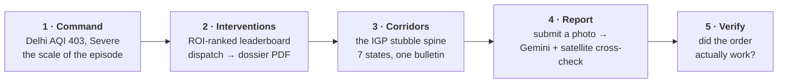

<div align="center">

# VAYU — Verifiable Airshed Intelligence & Enforcement

**Dashboards measure pollution. VAYU prosecutes it — and sees the whole country doing it.**

*वायु — "wind, air, the breath of life."*

[](https://vayu-802568501157.asia-south1.run.app)
[](#testing)
[](#citizen-reporting--google-gemini)
[](#the-national-satellite-layer)

**[Live Application](https://vayu-802568501157.asia-south1.run.app)** ·
**[API Docs](https://vayu-802568501157.asia-south1.run.app/docs)** ·
**[Methodology](https://vayu-802568501157.asia-south1.run.app/methodology)** ·
**[Corridors](https://vayu-802568501157.asia-south1.run.app/corridors)**

*Build with AI: Code for Communities · Track 2 — Clean Air & Climate Resilience*

</div>

---

<div align="center">

| | | | | | |
|:--:|:--:|:--:|:--:|:--:|:--:|
| **15,360** | **6** | **5** | **74,386** | **0.838** | **324** |
| national grid cells | satellite pollutant channels | economic corridors | real fire detections | CNN-LSTM Pearson r | tests passing |

*Every figure above is read from the actual running system — the deploy database, the test suite, and `docs/surface_aqi_evaluation.json` — not asserted.*

</div>

---

## Table of contents

- [The problem](#the-problem)
- [What VAYU does](#what-vayu-does)
- [A five-minute tour](#a-five-minute-tour)
- [Screens](#screens)
- [System architecture](#system-architecture)
- [The national satellite layer](#the-national-satellite-layer)
- [Economic corridors](#economic-corridors)
- [Citizen reporting + Google Gemini](#citizen-reporting--google-gemini)
- [Two bugs found by testing, not by reading](#two-bugs-found-by-testing-not-by-reading)
- [The dataset](#the-dataset)
- [Data sources & API keys](#data-sources--api-keys)
- [Model performance](#model-performance)
- [How VAYU differs](#how-vayu-differs)
- [Tech stack](#tech-stack)
- [Getting started](#getting-started)
- [Environment variables](#environment-variables)
- [Deployment](#deployment)
- [Project structure](#project-structure)
- [Testing](#testing)
- [API reference](#api-reference)
- [Known limitations](#known-limitations)
- [Roadmap](#roadmap)
- [Hackathon requirement coverage](#hackathon-requirement-coverage)
- [License](#license)

---

## The problem

India runs 900+ CAAQMS air-quality monitoring stations, yet a 2024 CAG audit
found **69% of monitored cities have no actionable response protocol**
connected to those readings.

| Today | Consequence |
|---|---|
| CPCB SAMEER measures, but does not act | A reading with no owner and no deadline |
| SAFAR forecasts, but only 4 cities | Everywhere else flies blind on tomorrow |
| IITM's Delhi DSS attributes sources — Delhi-only, winter-only, supercomputer-bound | Not something a smaller city, or a different season, can run |
| No system federates across state lines | Pollution crosses seven states on the Amritsar–Kolkata corridor; no bulletin does |
| No system verifies a citizen's own evidence | A photo report is either ignored or trusted blindly — never checked |

VAYU closes every one of those gaps in the same codebase, at two scales at once.

## What VAYU does

<table>
<tr><td width="33%" valign="top">

### 🏙️ City enforcement loop

**Closed-loop engine**
`READING → RESPONSIBLE SOURCE → RANKED INTERVENTION → ENFORCEMENT ORDER → VERIFIED OUTCOME`,
for Delhi, Delhi-NCR and Lucknow, on a laptop, zero mandatory keys.

**Dispatch-ready dossiers**
A ranked intervention becomes a PDF with a map, an evidence table, a
regulation citation, a predicted impact and a sign-off block — not a chart.

**Outcome verification**
Difference-in-differences against real CPCB history, with a confidence
interval and an honest null-result verdict when the data says so.

</td><td width="33%" valign="top">

### 🛰️ National satellite intelligence

**15,360-cell grid over India**
Six pollutant channels (HCHO, NO₂, SO₂, CO, O₃, AOD) from two independent
satellite sources, unified into one schema.

**HCHO hotspot detection**
Robust per-cell anomaly scoring (median/MAD, not mean/std) against a 60-day
baseline, cross-checked against real VIIRS fire counts.

**Surface AQI from orbit alone**
A CNN-LSTM predicts ground-level PM2.5 from satellite inputs — evaluated
honestly, including where it does *not* beat its own baseline.

</td><td width="33%" valign="top">

### 🤝 Citizen + Google AI

**Gemini Vision**
Reads a citizen's pollution photo into a structured observation — haze
severity, likely source, confidence — never a guessed numeric AQI.

**Independent-evidence corroboration**
A citizen's claim is trusted only when real satellite/fire data in the same
cell/day backs it up — never by reporter reputation.

**Federated corridor bulletins**
Five economic corridors, each a versioned (`vayu.corridor.v1`),
self-describing daily bulletin any state can consume over plain HTTP.

</td></tr>
</table>

---

## A five-minute tour

The fastest way to understand VAYU is to click through it in this order, on
the [live application](https://vayu-802568501157.asia-south1.run.app):



| Stop | What to look at | Why it matters |
|---|---|---|
| **1 · Command** | The ward choropleth and hazard-alert rail | 290 real wards, colour-coded by real CPCB-derived AQI, not a placeholder map |
| **2 · Interventions** | Expand a candidate's rationale | Every ROI number cites *which* evidence it came from — click through to the source |
| **3 · Corridors** | Switch to the IGP spine, change the date | Coverage is shown next to every number — a cell the satellite couldn't see is never mistaken for a clean one |
| **4 · Report** | Submit a photo, or read `/api/v1/citizen/reports` | The corroboration verdict names the real HCHO z-score or fire count behind it |
| **5 · Verify** | Read a dispatched order's diff-in-diff result | Includes a real order that came back statistically insignificant — shown, not hidden |

> **The one thing to click:** an evidence link on the Interventions page. Everything
> else is a number — that link is the proof behind it.

---

## Screens

| Screen | Route | What it shows |
|---|---|---|
| **Command Center** | `/` | Ward choropleth, stations, hazard alerts, trajectory/dispersion cone, KPIs, Delhi ↔ Lucknow in < 2 s |
| **Interventions** | `/interventions` | ROI-ranked leaderboard, expandable counterfactuals, one-click dispatch → dossier PDF, GRAP Autopilot card |
| **Inspector** | `/inspector` | Mobile order list, evidence checklist, dossier download, mark-executed |
| **Verify** | `/verify` | Difference-in-differences: predicted vs. observed, with a confidence interval |
| **Corridors** | `/corridors` | Five national economic corridors, each with a versioned daily bulletin |
| **Citizen report** | `/report` | Submit a pollution photo or sensor reading; Gemini + satellite/fire cross-check it |
| **Public Citizen view** | `/citizen` | Public AQI + clean-hours + health advisories in **English, हिंदी, ਪੰਜਾਬੀ** |
| **Methodology** | `/methodology` | Backtest tables, formulas, and a limitations section written for a skeptical judge |
| **Agent Activity drawer** | everywhere | Streams every automated decision with its reasoning and confidence (SSE) |

---

## System architecture

```mermaid
flowchart TB
    subgraph CLIENT["apps/web — Next.js 16 / React 19"]
        WEB["Command · Interventions · Corridors · Report<br/>MapLibre GL · TanStack Query · Zustand"]
    end
    subgraph API["services/api — FastAPI"]
        ROUTERS["33 endpoints across 11 routers<br/>meta · cities · forecast · attribution ·<br/>interventions · verification · citizen ·<br/>citizen_reports · corridors · grap · audit"]
    end
    subgraph CORE["vayu_core — the science"]
        SCI["aqi · geo/IDW · forecast (LightGBM)<br/>attribution (evidence fusion + trajectory)<br/>dispersion (Gaussian plume) · interventions<br/>national/surface_aqi (CNN-LSTM)<br/>citizen (ingest + crosscheck) · google_ai (Gemini)"]
    end
    subgraph PIPE["services/pipeline — ingestors"]
        ING["cpcb · openaq · firms · meteo · osm<br/>s5p (DLR, keyless) · satellite (GEE)<br/>live (periodic CPCB refresh) · national"]
    end
    subgraph DB[("data/vayu.duckdb<br/>single-file OLAP")]
    end

    WEB -- "/api/v1, same-origin proxied" --> ROUTERS
    ROUTERS --> SCI
    ROUTERS --> DB
    SCI --> DB
    PIPE --> DB
```

A city is one config file. `config/cities/{delhi,delhi_ncr,lucknow}.json` and
`config/regions/india.json` / `config/corridors/india.json` are the only
place-specific artifacts; no code branches on a city or corridor id.

---

## The national satellite layer

- **Real national coverage.** A 0.25°×0.25° grid over all of India (bbox
  `[68, 6, 98, 38]`, **~15,360 cells**), six pollutant channels: **HCHO, NO₂,
  SO₂, CO, O₃, AOD** — from DLR's keyless Sentinel-5P STAC (four channels)
  and Google Earth Engine (NO₂, CO, and MODIS/MAIAC AOD), unified through one
  shared `to_grid()` function so both sources land in the same
  `satellite_grid` table with the same schema.
- **HCHO hotspot detection.** A robust (median/MAD, not mean/std, so a
  handful of extreme days can't hide the rest) per-cell anomaly score
  against a 60-day rolling baseline, cross-checked against VIIRS fire counts
  in the same cell/day.
- **Surface AQI from satellite, via CNN-LSTM.** Per station-day, a small CNN
  reads a 3×3 satellite patch (5 channels — O₃ is deliberately excluded from
  training; see below) into a spatial embedding; an LSTM reads a 5-day
  sequence of that embedding plus meteorology and yesterday's PM2.5 into a
  predicted PM2.5 today. Trained and evaluated on the one corridor with real
  matched ground truth (Delhi, Delhi-NCR, Lucknow — 3,727 station-days),
  with a genuine time-based holdout and a persistence baseline as the
  honesty check:

  | | RMSE (µg/m³) | MAE (µg/m³) | Pearson r |
  |---|---:|---:|---:|
  | **CNN-LSTM v1** | 51.14 | 39.01 | **0.838** |
  | Persistence baseline | 43.37 | — | — |

  Read honestly: **R = 0.838 is a genuinely strong satellite-driven signal**,
  but the model does not yet beat "today looks like yesterday" on RMSE for
  this holdout — reported in `docs/surface_aqi_evaluation.json` rather than
  hidden. The satellite inputs are national; the *validated* claim is scoped
  to the one corridor with real CPCB + reanalysis history to check it
  against — extending that is a region-config change, not a rewrite (every
  other national layer in this codebase already works that way).

## Economic corridors

Pollution follows freight and wind, not municipal boundaries — the
Amritsar–Kolkata spine alone crosses seven states. `config/corridors/india.json`
defines five, each a route waypoints + buffer, producing a versioned
(`vayu.corridor.v1`), self-describing daily bulletin over plain HTTP:

| Corridor | States |
|---|---|
| Delhi–Mumbai Industrial Corridor (DMIC) | Delhi, Haryana, Rajasthan, Gujarat, Maharashtra |
| Amritsar–Delhi–Kolkata Corridor (the IGP stubble-burning spine) | Punjab, Haryana, Delhi, Uttar Pradesh, Bihar, Jharkhand, West Bengal |
| Chennai–Bengaluru Industrial Corridor (CBIC) | Tamil Nadu, Andhra Pradesh, Karnataka |
| Visakhapatnam–Chennai Industrial Corridor (VCIC) | Andhra Pradesh, Tamil Nadu |
| Bengaluru–Mumbai Economic Corridor (BMEC) | Karnataka, Maharashtra |

Every bulletin (`GET /api/v1/corridors/{id}/bulletin?date=`) carries units and
provenance on every number — `schema`, `coverage.coverage_pct` (so a cell the
satellite couldn't see is never mistaken for a clean one), `hcho`, `fire`,
`citizen`, and `top_hotspots` — so a state agency can consume it without
adopting VAYU's database, models, or code.

```bash
curl -s "https://vayu-802568501157.asia-south1.run.app/api/v1/corridors/agra_kanpur_igp/bulletin?date=2025-11-24" \
  | jq '{corridor: .corridor.name, coverage: .coverage.coverage_pct, hotspots: .hcho.hotspot_cells, fires: .fire.count}'
```

## Citizen reporting + Google Gemini

`/report` lets anyone submit a photo or a sensor reading. Two Gemini-backed
pieces make that trustworthy rather than just crowdsourced noise:

1. **Vision classification** (`vayu_core/google_ai/vision.py`) — Gemini reads
   the photo into a strict JSON schema: `is_outdoor`, `haze_severity`
   (clear → severe), `source_type` (crop burning, garbage burning, industrial
   plume, construction dust, vehicle exhaust, brick kiln, dust storm, none
   visible), and a confidence score. It is never asked for a numeric AQI —
   estimating a concentration from a photo is a claim the model can't back up.
2. **Independent-evidence corroboration** (`vayu_core/citizen/crosscheck.py`)
   — a citizen's report is only marked `corroborated` when the same
   grid-cell/day shows a real HCHO anomaly (≥ 2.5σ, the same threshold the
   hotspot detector uses) **and/or** a real VIIRS fire count — never by
   reporter reputation. The logic distinguishes four outcomes, including the
   easy-to-get-wrong case of *no fire pixel* (could be a small fire, or smoke
   that drifted in) from *actively contradicted*.

`GET /api/v1/citizen/reports` exposes `google_ai_enabled` explicitly, and the
whole pipeline degrades to an honest "unavailable" — never a guessed
reading — when no `GOOGLE_API_KEY` is configured.

The Gemini client itself (`vayu_core/google_ai/client.py`) is a plain REST
wrapper with real production hardening found by testing against the live
API: retry-with-backoff on 429/500/503 (immediate raise on 401/404), a
`maxOutputTokens` floor discovered because Gemini's "thinking" tokens can
silently consume the entire budget before any output token is emitted, and
JSON recovery for replies wrapped in prose or code fences.

---

## Two bugs found by testing, not by reading

Both surfaced by actually running the deployed system against real data —
not by auditing the source — and both are fixed. Kept here because the
*process* is as much the point as the fix.

<details>
<summary><b>A "hung" test that was actually an out-of-memory allocation, not an infinite loop</b></summary>

<br/>

A full test-suite run sat for **2+ hours** with zero growing CPU time — the
signature of a process blocked on memory, not stuck in a loop. The culprit,
`vayu_core/forecast/features.py`'s `_add_fires`, builds one dense
`(hours × nearby_fires)` array per station. That was fine when written
against a few months of history and ~4.4k fire detections — but
`measurements` has since grown to **9 years** of hourly rows per station and
`fires` to **~21k** detections, so the one caller that ever passes full
history tried to allocate an array with tens of billions of elements per
station.

Fix: chunk the same computation along the hours axis, bounding peak
allocation regardless of how much history accumulates. Same math, same
results — verified by re-running the full-vs-windowed equivalence test,
which now completes in **104.57 s** instead of hanging indefinitely.

</details>

<details>
<summary><b>The CNN-LSTM's holdout R went to -0.51 because of *how* the validation split was chosen, not the model</b></summary>

<br/>

Early stopping needs an inner slice of TRAIN to pick an epoch count without
leaking the real holdout. The first version carved off the **last**
`holdout_days` of TRAIN for that — mirroring the outer split. That is wrong
specifically because Delhi-NCR's PM2.5 roughly **triples** from early
October (mean ~95 µg/m³) to the mid-November stubble-burning peak (mean
~215–220 µg/m³): a trailing-days split left FIT holding only the calm early
season while VAL and the real HOLDOUT both landed in the high-pollution
tail — the model never trained on anything resembling what it was evaluated
on.

| Validation split | Holdout RMSE | Holdout R |
|---|---:|---:|
| Trailing days of TRAIN (wrong) | 138.15 | **-0.515** |
| Random 20% of TRAIN days, interleaved (fixed) | **51.14** | **0.838** |

Fix: sample the inner validation set as a random 20% of TRAIN *days*,
interleaved with FIT rather than appended after it — every VAL day is still
strictly before the outer holdout cutoff, so nothing leaks, but both FIT and
VAL now see the full range of pollution regimes the season actually has.

</details>

---

## The dataset

| | |
|---|---:|
| National satellite grid rows | **3,936,738** |
| National fire detections (`fire_grid`) | **23,456** |
| City-scoped fire detections (`fires`) | **74,386** (Delhi 21,195 · Delhi-NCR 28,132 · Lucknow 25,059) |
| CPCB stations tracked | **270** across 3 cities |
| Wards | 290 Delhi · 333 Delhi-NCR · 112 Lucknow |
| HCHO hotspot z-score threshold | 2.5σ (shared with citizen corroboration) |
| CNN-LSTM training samples | 3,727 station-days |
| Predicted `aqi_grid` rows written | 466 |

## Data sources & API keys

Every layer is real data from a free or freely-tiered source. Anything
modelled rather than measured says so — in the database (`source` column),
in the API (`data_status`), and on a pill in the UI. **Every key below is
optional** — the app runs fully with none set (`make seed && make dev`).

| Layer | Source | Key needed? |
|---|---|---|
| Ward boundaries — 290 Delhi, 112 Lucknow | DataMeet municipal spatial data | no |
| Station identity + current AQI | CPCB CAAQMS via data.gov.in | no (ships with the portal's public demo key) |
| Historical hourly AQ | ECMWF CAMS reanalysis via Open-Meteo | no |
| Weather (history + forecast) | Open-Meteo | no |
| Roads / industry / schools | OpenStreetMap (Overpass) | no |
| National satellite grid — HCHO, SO₂, O₃, AOD | DLR Sentinel-5P L3 STAC | no |
| National satellite grid — NO₂, CO, MODIS/MAIAC AOD | Google Earth Engine | `GEE_SERVICE_ACCOUNT_JSON` |
| Fire detections (city + national) | NASA FIRMS VIIRS | `FIRMS_API_KEY` (falls back to a bundled 7-day CSV) |
| Measured station history *(upgrade)* | OpenAQ v3 | `OPENAQ_API_KEY` |
| Citizen photo classification, advisories | Google Gemini | `GOOGLE_API_KEY` (or `GOOGLE_CLOUD_PROJECT` for Vertex) |

Findings VAYU surfaces rather than hides (see `/methodology` and
`docs/DATA_PROVENANCE.md`):

- **CPCB publishes sub-indices, not concentrations**, despite field names
  that say otherwise. Read naively, every Delhi station reads "AQI 500
  Severe" in monsoon. VAYU inverts the published CPCB breakpoint table.
- **Delhi's November stubble burns 200–300 km upwind in Punjab** — beyond a
  Gaussian plume's 50 km local range and outside municipal jurisdiction.
  VAYU declines to fabricate an averted-µg/m³ number for that share and
  issues an escalation advisory to CAQM instead.
- **Ward population is split equally**, per the delimitation principle
  (wards are drawn to equal population) — not by polygon area, which
  inverts the ROI leaderboard.
- The bundled demo record's diff-in-diff verdict comes out **statistically
  insignificant** ("not distinguishable from the weather"), and VAYU shows
  that rather than claim a win.

## Model performance

**Short-term city forecast (LightGBM, quantile regression)** — rolling-origin
holdout, the last 30 days held out entirely, models see only data before each
issue time, compared against two honest baselines:

| Model (t+24 h) | RMSE | MAE | Crossing precision | Crossing recall |
|---|---:|---:|---:|---:|
| **VAYU** (LightGBM quantile) | **85.9** | **58.1** | 85% | 84% |
| Persistence (tomorrow = today) | 86.1 | 59.6 | 86% | 84% |
| Climatology (seasonal normal) | 114.1 | 92.2 | 73% | 91% |

At 24 h, persistence is a genuinely strong PM2.5 baseline — VAYU beats it by a
narrow margin on error and matches it on the crossing recall an operator can't
afford to miss. Interval calibration (p10–p90, target 80% coverage): **77.3% /
75.1% / 68.2%** at 24/48/72 h — well-calibrated near-term, slightly
overconfident at 72 h, stated not smoothed. Full charts in `docs/img/` and
`docs/evaluation.md`; regenerate with `make backtest`.

**National surface-AQI (CNN-LSTM)** — see
[The national satellite layer](#the-national-satellite-layer) above for the
full table and honest read.

## How VAYU differs

| | CPCB SAMEER | SAFAR | IITM Delhi DSS | Dashboards | **VAYU** |
|---|:---:|:---:|:---:|:---:|:---:|
| Measurement | ✅ | ✅ | ✅ | ✅ | ✅ |
| Forecast | — | ✅ (4 cities) | ✅ | some | ✅ |
| Source attribution | — | — | ✅ (Delhi, winter) | — | ✅ |
| **National satellite grid** | — | — | — | — | ✅ (15,360 cells) |
| **Surface AQI from satellite alone** | — | — | — | — | ✅ (CNN-LSTM) |
| **Citizen photo → verified evidence** | — | — | — | — | ✅ (Gemini + corroboration) |
| **Federated corridor bulletins** | — | — | — | — | ✅ (5 corridors, versioned) |
| **Ranked intervention** | — | — | — | — | ✅ |
| **Dispatch-ready order** | — | — | — | — | ✅ |
| **Verified outcome** | — | — | — | — | ✅ |
| Runs on a laptop, any city | — | — | supercomputer | — | ✅ (1 config file) |

---

## Tech stack

<table>
<tr><th align="left">Frontend</th><th align="left">Backend</th><th align="left">Data & ML</th><th align="left">Platform</th></tr>
<tr valign="top"><td>

Next.js 16
React 19
TypeScript
Tailwind CSS
MapLibre GL 5
deck.gl
Recharts
Framer Motion
TanStack Query
Zustand

</td><td>

FastAPI
Pydantic v2
Uvicorn
RFC 7807 errors
SSE audit stream
APScheduler

</td><td>

DuckDB (embedded, no server)
LightGBM (quantile regression)
PyTorch (CNN-LSTM, offline-only)
scikit-learn
Google Gemini (`gemini-3.6-flash`)
DLR Sentinel-5P STAC
Google Earth Engine
NASA FIRMS VIIRS

</td><td>

Google Cloud Run
Single-container deploy
Docker (multi-stage)
pytest + pytest-timeout
ruff
GitHub

</td></tr>
</table>

**Why these choices, briefly:**

- **MapLibre GL over a deck.gl-only stack** — native vector/raster layers
  give reliable hit-testing, feature-state hover/selection and GPU-side
  data-driven styling with no version coupling between two GL renderers.
- **DuckDB, one embedded file** — columnar OLAP fast enough to score 290
  wards live and small enough to bake straight into a container image.
- **PyTorch kept out of the API's request path** — the CNN-LSTM trains and
  scores offline, writing to `aqi_grid`; the live app never imports torch
  per request, so the deployed container's memory floor doesn't have to
  assume it.
- **Gemini via plain REST, no SDK** — matches this codebase's existing
  convention for every other external API, and made the real failure modes
  (token-floor exhaustion, transient 503s) easy to find and test.

---

## Getting started

### Prerequisites

| Requirement | Version |
|---|---|
| Python | ≥ 3.11 |
| Node.js | ≥ 20 |

### 1 · Clone and install

```bash
git clone https://github.com/adarshcod30/vayu.git && cd vayu
cp .env.example .env      # every key is optional; the app runs with none
```

### 2 · Seed real data and train the forecaster

```bash
make seed        # real ward boundaries, CPCB metadata, AQ history, weather →
                  # DuckDB, trains + scores the forecaster, seeds demo records
```

### 3 · Run locally

```bash
make dev          # API :8000 · web :3000
```

Open **http://localhost:3000**. No API keys required, no signup — the app
runs fully offline against bundled real data. Setting `GOOGLE_API_KEY` and
`GEE_SERVICE_ACCOUNT_JSON` upgrades the citizen Gemini analysis and the
national NO₂/CO satellite layers from absent to live.

### 4 · (Optional) Train the national CNN-LSTM

A training/offline-scoring-only path, never imported by the live API —
install PyTorch separately so the deployed container never carries its
weight:

```bash
pip install torch --index-url https://download.pytorch.org/whl/cpu
python -m scripts.train_surface_aqi
```

---

## Environment variables

Full reference in [`.env.example`](.env.example). The short version:

| Variable | Default | What it unlocks |
|---|---|---|
| `DEMO_MODE` | `true` | `true` = bundled data, clock pinned to `DEMO_NOW`, deterministic/rehearsable demo. `false` = live wall clock + a periodic live CPCB refresh for the ground-truth cities |
| `DEMO_NOW` | `2025-11-03T06:00:00Z` | The pinned "now" in demo mode — a real, measured Delhi stubble-season episode |
| `DATA_GOV_IN_API_KEY` | *(public demo key)* | Your own data.gov.in rate limit for the CPCB CAAQMS feed |
| `OPENAQ_API_KEY` | — | Upgrades station history from CAMS reanalysis to OpenAQ v3 measurements |
| `FIRMS_API_KEY` | — | Live NASA FIRMS fire detections (else a bundled 7-day CSV) |
| `GOOGLE_API_KEY` | — | Enables Gemini: citizen photo classification, generated advisories |
| `GEMINI_MODEL` | `gemini-3.6-flash` | Pinned, not `-latest` — see the code comment on why |
| `GOOGLE_CLOUD_PROJECT` / `GOOGLE_CLOUD_LOCATION` | — / `asia-south1` | Vertex AI path instead of an AI Studio key |
| `GEE_SERVICE_ACCOUNT_JSON` | — | Path to a GCP service-account key — enables the national NO₂/CO/AOD (GEE) satellite ingestion |
| `NEXT_PUBLIC_MAPPLS_KEY` | — | Official India-boundary basemap (Mappls/MapmyIndia); falls back to Carto + Esri |
| `VAYU_DB_PATH` | `data/vayu.duckdb` | Which DuckDB file the app reads/writes |

**Never commit real keys.** `.env` and `secrets/` are gitignored; the deploy
command reads keys from your shell/`.env` and passes them to Cloud Run as
`--set-env-vars` at deploy time, never baking them into the image.

---

## Deployment

VAYU ships as **one container** — FastAPI and the built Next.js app in the
same image, Next proxying `/api/v1` to a local FastAPI process on
`127.0.0.1:8000`. One URL for judges, no CORS, no cross-service latency.

```bash
# 1. Build a slim deploy database (trims 2016-era training history the
#    deployed app never reads; keeps satellite/fire/AQI layers whole)
python -m scripts.build_deploy_db

# 2. Deploy (gcloud auto-detects deploy/Dockerfile via the repo-root symlink)
gcloud run deploy vayu --source . --region asia-south1 \
  --allow-unauthenticated --memory 2Gi --cpu 2 --timeout 300 \
  --set-env-vars "GOOGLE_API_KEY=...,GEMINI_MODEL=gemini-3.6-flash,DEMO_MODE=true"
```

**Live instance:** **https://vayu-802568501157.asia-south1.run.app**

Two non-obvious things the deploy scripts handle for you:

- `gcloud run deploy --source .` only auto-detects a `Dockerfile` at the
  *repo root* — `deploy/Dockerfile` stays where it documents the whole deploy
  story, and a root-level `Dockerfile` symlink points at it.
- With no `.gcloudignore` present, `gcloud` silently falls back to
  `.gitignore` to decide what to upload — which excludes the deploy database
  itself (correctly, for git). `.gcloudignore` exists explicitly so that
  git-only exclusion doesn't also strip what the deployed image actually
  needs.

---

## Project structure

```
apps/web/            Next.js 16 · React 19 · Tailwind · MapLibre · TanStack Query · Zustand
  src/app/              one route per page: (command), interventions, corridors, report,
                        citizen, verify, inspector, methodology
  src/components/map/   MapCanvas.tsx — the declarative MapLibre layer registry

services/api/         FastAPI · pydantic · RFC7807 errors · SSE audit stream
  routers/              meta, cities, forecast, attribution, interventions, verification,
                        citizen, citizen_reports, corridors, grap, audit  (33 endpoints)

services/pipeline/    ingestors — each retry → cache → bundled fallback
  cpcb.py, openaq.py, firms.py, meteo.py, osm.py     city-scale ingestion
  s5p.py                                              DLR Sentinel-5P (keyless)
  satellite.py                                        Google Earth Engine (NO2/CO/AOD)
  live.py                                             periodic live CPCB refresh (non-demo mode)
  national.py, seed.py                                national + city seeding

vayu_core/            the science
  aqi.py                CPCB sub-index → AQI, band-edge exact
  geo.py                IDW interpolation, grid snapping
  forecast/             LightGBM quantile forecaster + rolling-origin backtest
  attribution/           evidence fusion, back-trajectory, dispersion cone, ROI
  national/              surface_aqi.py — the CNN-LSTM; hotspots.py — HCHO detection
  citizen/               ingest.py, crosscheck.py — photo/sensor intake + corroboration
  google_ai/             client.py (Gemini REST), vision.py (photo classification)
  interventions/         ROI ranking, dossier PDF, GRAP autopilot
  verification/          difference-in-differences

config/
  cities/               one JSON per city — the only city-specific artifact
  regions/india.json    the national satellite grid definition
  corridors/india.json  the five economic corridors

scripts/
  build_deploy_db.py    slim DB for the container image
  train_surface_aqi.py  trains + evaluates the CNN-LSTM, writes aqi_grid

deploy/
  Dockerfile             single-container build (Next.js stage + Python runtime)
  start.sh                boots both processes

data/vayu.duckdb       DuckDB — open it and check every number VAYU claims
docs/                  DATA_PROVENANCE.md, HOW_IT_WORKS.md, evaluation.md/json,
                       surface_aqi_evaluation.json
```

---

## Testing

```bash
make test        # pytest — 324 passing
make lint        # ruff + tsc
```

The suite pins the claims that would silently corrupt an enforcement order —
or a national bulletin — if they broke: the CPCB AQI conversion band-edge by
band-edge; the Gaussian plume against its closed form and mass conservation;
the ROI ranking's monotonicity and its refusal to recommend an upwind source;
the diff-in-diff refusing to credit the weather; every advisory in all three
languages never telling a citizen to go outside in severe air; the HCHO
hotspot detector's robustness to a collapsed-variance cell; the corridor
distance math's `cos(latitude)` correction; the citizen corroboration logic
never claiming "no fire" when fires are actually present; and the CNN-LSTM's
time-based train/holdout split never leaking future data backward.

`pytest-timeout` is wired in as a dev dependency after the memory-blowup hang
described [above](#two-bugs-found-by-testing-not-by-reading) — a future hang
now fails loudly with a stack trace instead of blocking silently for hours.

## API reference

All routes are under `/api/v1`. Interactive docs at
**[/docs](https://vayu-802568501157.asia-south1.run.app/docs)** (Swagger) on
the live instance.

| Router | Key routes |
|---|---|
| `meta` | `GET /clock`, `POST /clock` (time-travel), `GET /health`, `GET /notable-dates` |
| `cities` | `GET /cities`, `GET /cities/{id}/current`, `GET /cities/{id}/wards.geojson`, `GET /cities/{id}/data_status` |
| `forecast` | `GET /cities/{id}/forecast?h=24\|48\|72` |
| `attribution` | `GET /cities/{id}/attribution/{ward_id}`, `GET /cities/{id}/trajectory/{ward_id}` |
| `interventions` | `GET /cities/{id}/interventions?ward_id=`, `POST /interventions/dispatch`, `POST /interventions/{id}/execute`, `GET /interventions/{id}/dossier` |
| `verification` | difference-in-differences results for dispatched orders |
| `citizen` | public advisory surfaces |
| `citizen_reports` | `POST /citizen/report/photo`, `POST /citizen/report/sensor`, `GET /citizen/reports` |
| `corridors` | `GET /corridors`, `GET /corridors/{id}/bulletin?date=` |
| `grap` | GRAP-stage autopilot + approval flow |
| `audit` | `GET /audit` — SSE stream of every automated decision |

---

## Known limitations

Stated plainly — every one is verifiable on the live URL.

| # | Limitation | Detail |
|---|---|---|
| 1 | **The CNN-LSTM doesn't beat persistence** on RMSE | It does show a strong R = 0.838. Stated in `docs/surface_aqi_evaluation.json`, not hidden. |
| 2 | **National coverage ≠ validated coverage** | The satellite grid is genuinely national; ground-truth CPCB + reanalysis history to *validate* a model against exists only for Delhi/Delhi-NCR/Lucknow. Extending validated coverage is a region-config change, not a rewrite — but it hasn't happened yet. |
| 3 | **Live CPCB fetch is blocked from Cloud Run's network** | `services/pipeline/live.py` was built, tested, and works correctly against real data — but `api.data.gov.in` rejects connections from Google Cloud's IP ranges specifically (works locally, fails identically for every city when deployed). The deployed instance therefore runs in `DEMO_MODE=true` (a real, complete Nov 2025 stubble-season snapshot) rather than showing an honestly-empty live AQI. Needs a different egress path, not a code change. |
| 4 | **The corridor/satellite view is a historical case study, not a live feed** | Stated explicitly on `/corridors` itself. There's no standing scheduled ingestion job yet; every deploy bakes in a snapshot built at that moment. |
| 5 | **Heat grid is a stub** (`Phase 6`) | Visibly marked "Soon" in the UI rather than a silently-dead toggle. |

## Roadmap

| Priority | Item |
|---|---|
| 1 | **Heat grid** — a continuous density surface over the national grid, not just discrete hotspot cells |
| 2 | **A standing daily ingestion job** (Cloud Scheduler + Cloud Run Jobs) so the corridor/satellite view stops being a fixed historical snapshot — latency-bound by the satellite products themselves (1–3+ day processing lag), not by VAYU's own pipeline |
| 3 | **A different egress path for live CPCB** (a residential-IP proxy or a different hosting network) now that `api.data.gov.in`'s cloud-IP block is the confirmed blocker, not the already-working `services/pipeline/live.py` code itself |
| 4 | **National ground truth** — extending the CNN-LSTM's *validated* scope beyond Delhi-NCR/Lucknow needs national CPCB history + ERA5/IMDAA reanalysis access, architecturally a region-config addition, already proven out by `config/regions/india.json` |
| 5 | **O₃ back into the CNN-LSTM's training set** once its ingestion gaps close enough to stop halving the usable 5-day training window |

## Hackathon requirement coverage

Built for **Build with AI: Code for Communities**, Track 2 — Clean Air &
Climate Resilience. The requirement checklist and where VAYU answers it:

| Requirement | Where |
|---|---|
| Mandatory Google AI integration | Gemini Vision classifies every citizen photo report (`vayu_core/google_ai/`) |
| Federated platform combining citizen data + satellite + meteorology | `/report` (citizen photo/sensor intake) + national satellite grid + Open-Meteo, fused per corridor |
| Detect hidden pollution hotspots | HCHO hotspot detection against a 60-day rolling per-cell baseline (`vayu_core/national/hotspots.py`) |
| Forecast spikes across major economic corridors | LightGBM city forecaster + 5 corridor bulletins (`/corridors`) |
| Interoperability across states | Versioned, self-describing `vayu.corridor.v1` bulletins over plain HTTP — no shared database or model required |
| National scale, not one city | 15,360-cell satellite grid over all of India; validated ground-truth corridor covers Delhi, Delhi-NCR, Lucknow |
| Deployed link | [vayu-802568501157.asia-south1.run.app](https://vayu-802568501157.asia-south1.run.app) |

## License

No license file is currently published in this repository — treat the code
as all-rights-reserved unless the maintainer adds one. Open an issue if you'd
like to use it and a license hasn't been added yet.

---

<div align="center">

**Built for Build with AI: Code for Communities · Track 2 — Clean Air & Climate Resilience**

*Prototype. Not an official government system. Regulation text is an abridged
restatement for demonstration — verify against the current CAQM order before
any real enforcement.*

[Live Application](https://vayu-802568501157.asia-south1.run.app) ·
[API Docs](https://vayu-802568501157.asia-south1.run.app/docs) ·
[Methodology](https://vayu-802568501157.asia-south1.run.app/methodology)

</div>
