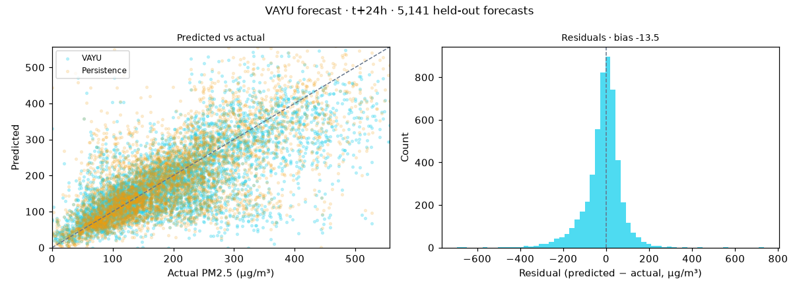
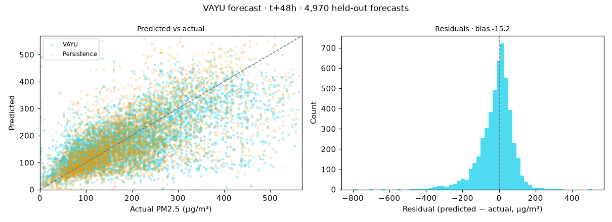
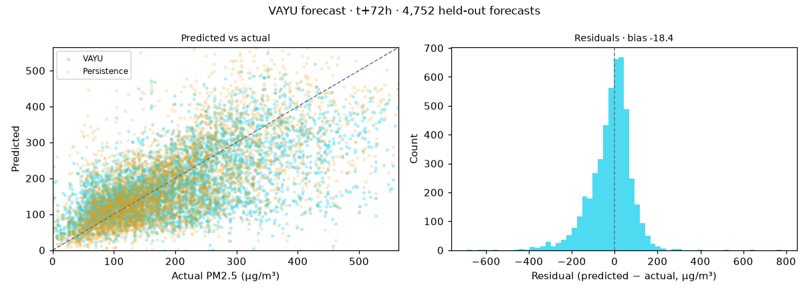

# VAYU — Forecast Evaluation

> Auto-generated by `make backtest`. Do not edit by hand.
> Generated 2026-07-17T08:01:27Z · cities: delhi, lucknow

## Protocol

- **Holdout:** the last **30 days** (2025-10-25 → 2025-11-24) are excluded from
  training entirely. Models are retrained on pre-cutoff data only, into a separate
  artifact directory, and any row whose *target* falls inside the holdout is dropped —
  so no evaluated forecast was ever trained on.
- **Origins:** forecasts issued at 00:00, 06:00, 12:00, 18:00 UTC each day.
- **Baselines:** persistence (value at issue time) and climatology (month × hour-of-day mean,
  computed on training data only).
- **Crossing detection:** event = actual AQI ≥ 300 at the target hour.

## Accuracy vs baselines

Lower RMSE/MAE is better. **Bold** = best in column.

| Horizon | Model | n | RMSE (µg/m³) | MAE (µg/m³) | AQI bucket acc. |
|---|---|---:|---:|---:|---:|
| t+24h | VAYU | 5,141 | **85.9** | 58.1 | 56.0% |
| t+24h | Persistence | 4,961 | 86.1 | 59.6 | 56.0% |
| t+24h | Climatology | 5,141 | 114.1 | 92.2 | 38.9% |
| t+48h | VAYU | 4,970 | **93.3** | 65.0 | 51.0% |
| t+48h | Persistence | 4,696 | 95.5 | 67.7 | 51.1% |
| t+48h | Climatology | 4,970 | 117.3 | 95.0 | 39.0% |
| t+72h | VAYU | 4,752 | **97.4** | 69.3 | 47.7% |
| t+72h | Persistence | 4,475 | 98.0 | 70.8 | 48.6% |
| t+72h | Climatology | 4,752 | 118.0 | 95.5 | 40.0% |

### Improvement over persistence

| Horizon | VAYU RMSE | Persistence RMSE | Improvement |
|---|---:|---:|---:|
| t+24h | 85.9 | 86.1 | **+0.3%** |
| t+48h | 93.3 | 95.5 | **+2.3%** |
| t+72h | 97.4 | 98.0 | **+0.7%** |

## Hazard-crossing detection (AQI ≥ 300)

The decision-relevant metric: RMSE can be won by hugging the mean and never calling a
spike, which would be operationally useless. This table asks whether VAYU actually
flags the hazard.

| Horizon | Model | Events | Precision | Recall |
|---|---|---:|---:|---:|
| t+24h | VAYU | 3595 | 85.4% | 83.8% |
| t+24h | Persistence | 3490 | 86.3% | 84.2% |
| t+24h | Climatology | 3595 | 72.6% | 91.4% |
| t+48h | VAYU | 3487 | 82.7% | 82.4% |
| t+48h | Persistence | 3357 | 86.4% | 81.9% |
| t+48h | Climatology | 3487 | 72.5% | 93.7% |
| t+72h | VAYU | 3369 | 81.2% | 80.6% |
| t+72h | Persistence | 3185 | 84.0% | 81.8% |
| t+72h | Climatology | 3369 | 72.7% | 95.6% |

## Uncertainty calibration

The p10–p90 band should contain ~80% of actuals. Meaningfully above means the band is
too wide (useless); below means it is overconfident (dangerous).

| Horizon | Actuals inside p10–p90 | Target |
|---|---:|---:|
| t+24h | 77.3% | 80% |
| t+48h | 75.1% | 80% |
| t+72h | 68.2% | 80% |

## Charts

## What these numbers actually say

- **VAYU beats persistence at t+24h, but narrowly** (85.9 vs 86.1 RMSE, +0.3%). Persistence is a genuinely strong baseline for 24h PM2.5 — hourly pollution is highly autocorrelated, and 'tomorrow looks like today' is right most of the time. A small margin here is the honest result, not a disappointing one, and it is why the crossing-detection table matters more than RMSE.
- **Climatology's RMSE is not a win.** It scores by predicting something near the   seasonal mean every day, which is why its AQI-bucket accuracy and crossing   precision collapse. A model that never calls a spike is useless to a commissioner   deciding whether to halt a construction site tonight.
- **What persistence cannot do**, and why VAYU is not merely a tie: persistence gives   no uncertainty band, exists only where a station exists (VAYU scores every ward),   offers no attribution, and cannot be asked *why*. The forecast is an input to the   intervention, not the product.

## Limitations

- Evaluated at **station** locations. Ward-level values are IDW-interpolated from these,
  so wards far from any station carry additional error not captured here (they are
  flagged `low_confidence` in the API and watermarked in the UI).
- Weather at prediction time comes from Open-Meteo's **historical forecast archive** —
  what the forecast actually said at the time, not reanalysis. The model therefore
  inherits the weather model's own error, which is the realistic operational setup
  rather than a perfect-foresight upper bound. The exception is the 2016-2018 training
  winters, where that archive does not reach back and reanalysis stands in; that
  affects training only, never this evaluation.
- **The measured record has a hole.** OpenAQ's Delhi stations ran 2016-2018, went
  quiet, and resumed in Feb 2025 on new sensor ids. Training therefore spans two past
  stubble winters plus Feb-Oct 2025, with nothing in between. Before those winters were
  added the model had never seen a November and lost to persistence by 53%.
- 30 days is a short holdout covering one season. It is what the measured
  record supports; more history would test more regimes.
- Quantile models are fit independently per horizon, so the p10-p90 band is calibrated
  empirically (see above) rather than by construction.
- See `docs/DATA_PROVENANCE.md` for source-level caveats.
